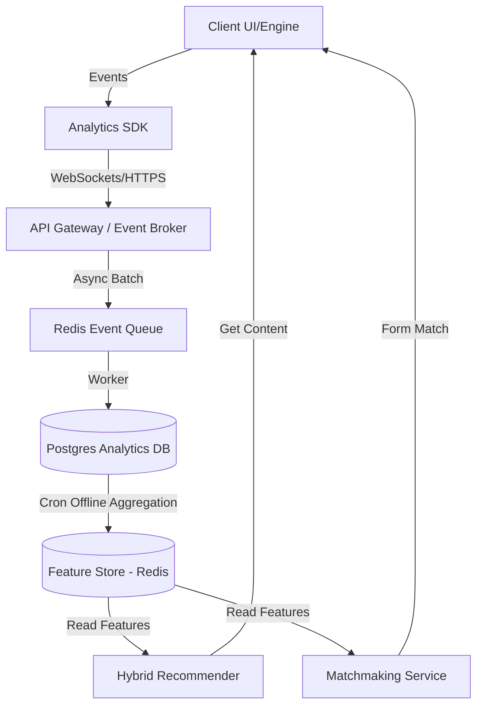

# Roadmap Maestro de Ingeniería y Producto - Motor de Experiencias

Este documento sirve como la **fuente de verdad estratégica y arquitectónica** para la evolución del producto hacia un ecosistema social altamente retentivo, orientado al descubrimiento y al retorno inteligente. Ha sido diseñado por la IA Maestra Arquitecta para ser consumido y ejecutado por IAs trabajadoras de forma secuencial sin requerir reinterpretación de contexto.

---

## ESTRUCTURA DEL ROADMAP (50 FASES)

### FASE 1: Configuración de la Infraestructura de BD para Analítica y Telemetría

*   **Objetivo estratégico:** Establecer la base de persistencia física para eventos crudos de telemetría y datos analíticos sin interferir con la base de datos de producción operacional.
*   **Por qué ocurre en este momento:** Es el fundamento indispensable. No podemos capturar telemetría ni diseñar modelos predictivos sin una base de datos analítica dedicada (Read-Replica o BD columnar) para evitar la degradación del rendimiento de juego.
*   **Contexto:** Actualmente existe una base de datos PostgreSQL operada por Prisma. Debemos crear un esquema separado o base de datos analítica dedicada para almacenar eventos crudos.
*   **Inputs requeridos:** Esquema actual de Prisma (schema.prisma). Acceso de lectura a la base de datos PostgreSQL de producción.
*   **Tareas ejecutables:**
    * Diseñar una base de datos PostgreSQL analítica dedicada (o esquema separado 'analytics').
    * Crear el modelo de tablas para almacenar eventos crudos en formato JSONB con indexación por tipo de evento, userId y timestamp.
    * Configurar un pipeline de réplica lógica o de solo lectura para sincronizar usuarios y mapas hacia la BD analítica.
*   **Dependencias:** Ninguna (Fase fundamental inicial).
*   **Riesgos:** Sobrecarga de la base de datos transaccional operacional al realizar las consultas analíticas iniciales.
*   **Entregables:**
    * Script SQL/Prisma para la inicialización del esquema analítico.
    * Configuración de conexión segura separada en variables de entorno.
*   **Métricas de éxito:** Latencia de consultas analíticas < 50ms; Cero impacto en la latencia de transacciones de juego en producción.
*   **Validación:** Ejecutar pruebas de carga simulando 1000 eventos/segundo concurrentes sobre la BD analítica y monitorear el uso de CPU de la BD operacional.
*   **Equipos involucrados:** Principal Backend Architect, Principal Data Engineer.
*   **Notas para la IA trabajadora:** Utiliza tablas particionadas por fecha para facilitar la purga y archivado futuro.
*   **MD de seguimiento que debe generarse:** `graphify-out/wiki/fase_01_infra_db.md`
*   **Qué habilita para fases posteriores:** Habilita la Fase 2 (transporte local) y Fase 6 (ingesta de eventos de navegación).

---

### FASE 2: Arquitectura del Broker de Eventos y Transporte Local

*   **Objetivo estratégico:** Diseñar e implementar un sistema de mensajería asíncrona local (broker) en memoria o mediante Redis local para amortiguar y encolar eventos de telemetría antes de persistirlos.
*   **Por qué ocurre en este momento:** Los clientes de juego generan ráfagas de eventos de telemetría de alta frecuencia. Enviar cada evento de forma síncrona a la BD saturaría los sockets de red del servidor.
*   **Contexto:** El motor actual utiliza un servidor WebSocket (server/server.ts o similar) para multiplayer. Debemos inyectar un despachador de eventos asíncrono.
*   **Inputs requeridos:** Protocolo WebSocket del servidor actual.
*   **Tareas ejecutables:**
    * Implementar un Event Buffer local en memoria (Node.js) con límites de tamaño máximo (Backpressure).
    * Integrar Redis (usando los manejadores existentes en la aplicación) como broker temporal para persistencia en cola.
    * Escribir un worker ligero en background que procese la cola en lotes (batching) y escriba en la BD analítica.
*   **Dependencias:** Fase 1 (BD Analítica).
*   **Riesgos:** Pérdida de eventos en memoria si el proceso Node.js se cae inesperadamente antes de vaciar el buffer.
*   **Entregables:**
    * Código del EventBuffer y el worker de batching en `server/analytics/`.
    * Tests unitarios de presión de memoria.
*   **Métricas de éxito:** Pérdida de eventos < 0.1% bajo carga de 5000 eventos/seg; consumo de memoria del server estable (< 200MB adicionales).
*   **Validación:** Simular caídas del servidor y validar que la cola persistida en Redis no se corrompa y sea recuperada por el worker.
*   **Equipos involucrados:** Principal Backend Architect, Principal Software Architect.
*   **Notas para la IA trabajadora:** No uses bibliotecas externas pesadas; una implementación simple con Redis list (RPUSH/LPOP) es suficiente en esta fase.
*   **MD de seguimiento que debe generarse:** `graphify-out/wiki/fase_02_event_broker.md`
*   **Qué habilita para fases posteriores:** Habilita la Fase 3 (Schema Registry) y Fases de Ingesta.

---

### FASE 3: Diseño del Schema Registry de Eventos

*   **Objetivo estratégico:** Definir e imponer contratos estructurados (schemas) para todos los eventos del sistema mediante validación TypeScript y JSON Schema.
*   **Por qué ocurre en este momento:** Si las IAs trabajadoras introducen eventos con nombres de campos inconsistentes o tipos incorrectos, los análisis posteriores fallarán por corrupción de datos.
*   **Contexto:** Necesitamos un catálogo de esquemas estricto que valide los eventos en la frontera del servidor.
*   **Inputs requeridos:** Tipos y contratos existentes en la carpeta `src/client/types/`.
*   **Tareas ejecutables:**
    * Definir esquemas JSON Schema para eventos basales: PageView, SessionStart, MatchJoin, MatchLeave.
    * Implementar middleware de validación en Node.js que descarte eventos mal formateados en la entrada del broker.
    * Generar tipos de TypeScript automáticos a partir de los JSON Schemas.
*   **Dependencias:** Fase 2 (Event Broker).
*   **Riesgos:** Rechazo masivo de telemetría útil si los clientes envían esquemas ligeramente desalineados por desfases de versión.
*   **Entregables:**
    * Middleware de validación de esquemas en `server/analytics/middleware.ts`.
    * Repositorio local de esquemas en `server/analytics/schemas/`.
*   **Métricas de éxito:** Validación de esquema ejecutada en < 1ms por evento; 100% de los eventos maliciosos u obsoletos bloqueados.
*   **Validación:** Enviar payloads con tipos erróneos (ej. userId como integer en lugar de string) y verificar que el middleware los rechace con el código de error correspondiente.
*   **Equipos involucrados:** Principal Software Architect, Principal QA Strategist.
*   **Notas para la IA trabajadora:** Usa la biblioteca `ajv` para validación ultra rápida de JSON Schema en Node.js.
*   **MD de seguimiento que debe generarse:** `graphify-out/wiki/fase_03_schema_registry.md`
*   **Qué habilita para fases posteriores:** Habilita la Fase 4 (Feature Store primitivo) y todas las ingestas estructuradas.

---

### FASE 4: Setup del Feature Store Primitivo (Tablas PostgreSQL dedicadas)

*   **Objetivo estratégico:** Diseñar y crear las tablas agregadas para almacenar features precalculadas del jugador y mapas (perfiles analíticos en caliente).
*   **Por qué ocurre en este momento:** Para que las IAs ejecutoras consulten variables derivadas de baja latencia al vuelo sin recalcular agregaciones pesadas en cada llamada de API.
*   **Contexto:** Necesitamos una tabla que represente al jugador agregando su historial analítico rápido.
*   **Inputs requeridos:** Modelos de `User` y `GameMap` de Prisma.
*   **Tareas ejecutables:**
    * Diseñar la tabla `PlayerFeatures` con campos clave: `lastActive`, `totalPlayTime`, `matchesPlayed`, `preferredLanguage`.
    * Diseñar la tabla `MapFeatures` con campos clave: `totalJoins`, `averageDuration`, `bounceRate`.
    * Crear el esquema de actualización diferida (cron o triggers en la base de datos analítica).
*   **Dependencias:** Fase 1 (BD Analítica), Fase 3 (Schemas).
*   **Riesgos:** Inconsistencia de datos si las actualizaciones en batch fallan o se desfasan significativamente del estado real de la BD.
*   **Entregables:**
    * Modelos de Prisma nuevos agregados a `prisma/schema.prisma`.
    * Scripts de migración generados y ejecutados.
*   **Métricas de éxito:** Tiempo de lectura de features < 5ms por ID de usuario; 100% de consistencia relacional.
*   **Validación:** Realizar consultas concurrentes a `PlayerFeatures` simulando lecturas masivas y confirmar que la latencia se mantenga bajo el umbral.
*   **Equipos involucrados:** Principal Backend Architect, Principal Data Engineer.
*   **Notas para la IA trabajadora:** Mantén las escrituras desacopladas del hilo principal de Node.js mediante consultas asíncronas no bloqueantes.
*   **MD de seguimiento que debe generarse:** `graphify-out/wiki/fase_04_feature_store_setup.md`
*   **Qué habilita para fases posteriores:** Habilita la Fase 11 (abstracción de variables) y Fase 16 (Modelo de datos).

---

### FASE 5: Framework de Migraciones de Datos Analíticos (Evolución Segura)

*   **Objetivo estratégico:** Crear el mecanismo para alterar y evolucionar esquemas de telemetría y tablas de agregación analítica de forma segura y sin tiempo de inactividad.
*   **Por qué ocurre en este momento:** A medida que el ecosistema crezca, agregaremos señales. Sin migraciones analíticas controladas, romperemos los modelos de recomendación existentes al cambiar columnas.
*   **Contexto:** Debemos extender Prisma Migrations o usar herramientas de migración SQL nativas para la BD analítica separada.
*   **Inputs requeridos:** Flujo de integración de Prisma.
*   **Tareas ejecutables:**
    * Definir el flujo de despliegue en dos fases (Expand and Contract) para cambios de base de datos.
    * Implementar script para versionado independiente de la base de datos de analytics.
    * Crear test automático de regresión de migraciones analíticas en el pipeline de CI.
*   **Dependencias:** Fase 1 y Fase 4.
*   **Riesgos:** Bloqueo de tablas analíticas grandes durante alteraciones de esquemas bajo carga de producción.
*   **Entregables:**
    * Pipeline de migración configurado y documentado en `scripts/migrate-analytics.ts`.
    * Documento de estándares de evolución de esquema.
*   **Métricas de éxito:** Cero tiempo de inactividad en lecturas analíticas durante la aplicación de migraciones; tasa de error de scripts = 0%.
*   **Validación:** Simular una migración de adición de columna en un entorno de staging con lectura/escritura concurrentes activas y medir la tasa de fallos de consulta.
*   **Equipos involucrados:** Principal Software Architect, Principal Data Engineer, Principal QA Strategist.
*   **Notas para la IA trabajadora:** Nunca uses `ALTER TABLE` con valores por defecto complejos en tablas con millones de filas de eventos de forma directa.
*   **MD de seguimiento que debe generarse:** `graphify-out/wiki/fase_05_data_migrations.md`
*   **Qué habilita para fases posteriores:** Habilita la Fase 21 (Calidad de datos) y asegura la estabilidad de las 45 fases posteriores.

---

### FASE 6: Ingesta de Eventos de Navegación y Page Views (Lobby, Catálogo)

*   **Objetivo estratégico:** Registrar cuándo, cómo y desde dónde navegan los usuarios por las diferentes pantallas de la aplicación.
*   **Por qué ocurre en este momento:** Para entender el embudo de conversión y saber qué pantallas retienen más atención antes de que el usuario decida iniciar una experiencia.
*   **Contexto:** La interfaz actual tiene una pantalla de Lobby, editor y catálogo. Debemos inyectar listeners analíticos en las rutas del cliente.
*   **Inputs requeridos:** Enrutador cliente (`src/client/routing/Router.ts` o equivalente). Esquemas de Fase 3.
*   **Tareas ejecutables:**
    * Interceptar cambios de ruta en `Router.ts` para disparar el evento `page_view`.
    * Capturar en el payload: `fromRoute`, `toRoute`, `userId` (o `guestId`), `deviceType` y `timestamp`.
    * Enviar el payload validado al endpoint analítico `/api/analytics/event`.
*   **Dependencias:** Fase 3 (Schema Registry).
*   **Riesgos:** Generación excesiva de eventos duplicados por redirecciones rápidas del cliente, inflando costos e invalidando métricas.
*   **Entregables:**
    * Cliente analítico frontend inyectado en `src/client/utils/analytics.ts`.
    * Controlador en backend `/api/analytics/event` conectado al broker.
*   **Métricas de éxito:** Tasa de eventos huérfanos (sin userId o timestamp) = 0%; Latencia añadida al cliente < 2ms.
*   **Validación:** Navegar manualmente por el Lobby, Editor y Catálogo; verificar que los registros en la BD analítica coincidan exactamente con la secuencia de navegación.
*   **Equipos involucrados:** Principal UX Strategist, Principal Software Architect, Principal Backend Architect.
*   **Notas para la IA trabajadora:** Asegura debouncing en eventos de navegación rápida (< 500ms) para evitar registrar rebotes accidentales.
*   **MD de seguimiento que debe generarse:** `graphify-out/wiki/fase_06_ingestion_navigation.md`
*   **Qué habilita para fases posteriores:** Habilita la Fase 27 (Análisis de Funnels) y la Fase 32 (Preferencias de contexto).

---

### FASE 7: Telemetría de Sesión y Permanencia

*   **Objetivo estratégico:** Medir con precisión la duración de la sesión del usuario, sus focos de inactividad (tab out/idle) y el tiempo útil de permanencia activa.
*   **Por qué ocurre en este momento:** La retención no es solo volver, es la calidad del tiempo invertido. Necesitamos distinguir tiempo activo de juego de pestañas dejadas olvidadas en el fondo.
*   **Contexto:** Debemos monitorear eventos del ciclo de vida de la página web (`visibilitychange`, `blur`, `focus`).
*   **Inputs requeridos:** Cliente analítico (`src/client/utils/analytics.ts`).
*   **Tareas ejecutables:**
    * Registrar el evento `session_start` al cargar la aplicación y `session_end` al descargarla (utilizando `sendBeacon` para fiabilidad).
    * Implementar un heartbeat en el cliente cada 60 segundos que registre el estado de visibilidad (`tab_active` o `tab_inactive`).
    * Calcular la métrica derivada 'Tiempo Útil de Sesión' restando periodos inactivos.
*   **Dependencias:** Fase 6 (Navegación).
*   **Riesgos:** Cálculo inexacto del tiempo de sesión por bloqueadores de anuncios que impiden el envío de eventos de descarga (`unload`).
*   **Entregables:**
    * Mapeo de eventos de ciclo de vida en `src/client/utils/analytics.ts`.
    * Estructura de datos en la base analítica para sesiones y heartbeats.
*   **Métricas de éxito:** 98% de precisión en la medición de la duración de la sesión activa en comparación con tiempos de WebSocket del servidor.
*   **Validación:** Abrir el catálogo, minimizar la pestaña por 5 minutos, volver a activarla y cerrar la pestaña. Validar que la BD registre exactamente 5 minutos de tiempo inactivo.
*   **Equipos involucrados:** Principal UX Strategist, Principal Product Analyst.
*   **Notas para la IA trabajadora:** Utiliza `navigator.sendBeacon` para garantizar el envío del evento `session_end` incluso si el usuario cierra el navegador repentinamente.
*   **MD de seguimiento que debe generarse:** `graphify-out/wiki/fase_07_session_telemetry.md`
*   **Qué habilita para fases posteriores:** Habilita la Fase 15 (Intención de retorno) y la Fase 26 (Cohortes de retención).

---

### FASE 8: Telemetría de Interacción de Juego (Joins, Abandons, Match Starts/Ends)

*   **Objetivo estratégico:** Registrar de manera granular el ciclo de vida de una partida en cualquier experiencia web.
*   **Por qué ocurre en este momento:** Para calcular tasas de abandono prematuro, rebote de mapas y duración exacta de las experiencias, base fundamental para los algoritmos de recomendación.
*   **Contexto:** Actualmente los usuarios se unen a salas y juegan. Debemos capturar estas transiciones en el servidor multiplayer y persistirlas.
*   **Inputs requeridos:** Lógica del servidor de salas/partidas (`server/` y `src/client/network/NetworkManager.ts`).
*   **Tareas ejecutables:**
    * Instrumentar el flujo de conexión a una sala para emitir `match_join`.
    * Instrumentar la desconexión voluntaria e involuntaria para emitir `match_leave` o `match_abandon` indicando la razón (ej. ping alto, clic en salir, error).
    * Registrar `match_start` y `match_end` con los marcadores y estadísticas de final de partida.
*   **Dependencias:** Fase 7 (Sesión).
*   **Riesgos:** Desconexiones de red que generen falsos abandonos en lugar de caídas normales de sesión.
*   **Entregables:**
    * Handlers instrumentados en el servidor de WebSocket de producción.
    * Esquema relacional de tablas `Match` y `MatchPlayer` analíticas actualizadas.
*   **Métricas de éxito:** Discrepancia entre eventos de servidor y base de datos < 0.05%.
*   **Validación:** Iniciar una partida multiplayer, simular desconexión por pérdida de red y verificar que se registre con un tipo de abandono diferenciado (network_drop).
*   **Equipos involucrados:** Principal Game Systems Designer, Principal Backend Architect.
*   **Notas para la IA trabajadora:** Asegura mapear el UUID del mapa exacto para correlacionar abandonos con experiencias específicas.
*   **MD de seguimiento que debe generarse:** `graphify-out/wiki/fase_08_game_interaction_telemetry.md`
*   **Qué habilita para fases posteriores:** Habilita la Fase 12 (Perfil explorador/repetidor) y la Fase 17 (Modelo de experiencias).

---

### FASE 9: Telemetría de Interacción de Interfaz (Clicks, Scroll Depth, CTR)

*   **Objetivo estratégico:** Registrar clics en botones de recomendación, profundidad de desplazamiento en el catálogo y ratio de clics en banners.
*   **Por qué ocurre en este momento:** Permite calcular la efectividad del catálogo de descubrimiento y evaluar si los layouts dopaminérgicos están capturando o frustrando la atención.
*   **Contexto:** La UI web se renderiza en el cliente. Instrumentaremos componentes UI clave como el catálogo de mapas y menús.
*   **Inputs requeridos:** Componentes UI del cliente (`src/client/ui/`).
*   **Tareas ejecutables:**
    * Añadir listeners genéricos de telemetría a los contenedores de recomendación utilizando delegación de eventos.
    * Registrar exposiciones a recomendaciones (`recommendation_impression`) y sus consecuentes clics (`recommendation_click`).
    * Registrar profundidad de scroll en el catálogo para medir hasta dónde exploran los usuarios antes de abandonar.
*   **Dependencias:** Fase 6 (Navegación).
*   **Riesgos:** Saturación del tráfico de red debido al envío continuo de eventos de scroll o impresiones repetitivas.
*   **Entregables:**
    * Biblioteca de rastreo de UI en `src/client/ui/analytics-ui.ts`.
    * Estructura de datos para CTR e impresiones.
*   **Métricas de éxito:** Impacto en renderizado de UI = 0 fps perdidos; volumen de datos extra < 10KB por sesión.
*   **Validación:** Abrir el catálogo, hacer scroll hasta el final y hacer clic en un mapa. Comprobar que se registren exactamente las impresiones de los mapas expuestos en el viewport y el CTR final.
*   **Equipos involucrados:** Principal UX Strategist, Principal Product Analyst.
*   **Notas para la IA trabajadora:** Utiliza un IntersectionObserver en el cliente para disparar impresiones de recomendaciones solo si el elemento es visible en pantalla > 1 segundo.
*   **MD de seguimiento que debe generarse:** `graphify-out/wiki/fase_09_ui_telemetry.md`
*   **Qué habilita para fases posteriores:** Habilita la Fase 13 (Sensibilidad a la popularidad) y la Fase 29 (CTR).

---

### FASE 10: Telemetría del Editor de Mapas y Creación de Contenido

*   **Objetivo estratégico:** Rastrear las acciones del usuario dentro del editor de mapas: colocación de objetos, tiempos de diseño y publicaciones.
*   **Por qué ocurre en este momento:** El UGC (contenido generado por usuarios) alimenta el catálogo de descubrimiento. Entender las fricciones en el editor permite optimizar herramientas para retener a los creadores.
*   **Contexto:** El editor de mapas existente permite colocar objetos 3D. Instrumentaremos el flujo de guardado y manipulación.
*   **Inputs requeridos:** Editor de mapas del cliente (`src/client/ui/ConstructionMenu.ts` y relacionados).
*   **Tareas ejecutables:**
    * Registrar evento `editor_open` y `editor_close` con duración de sesión de edición.
    * Rastrear el conteo de elementos colocados (`objects_placed`, `objects_deleted`) y errores de guardado.
    * Registrar transiciones de estado de mapa: guardado local, versión creada y publicación final.
*   **Dependencias:** Fase 8 (Interacción de Juego).
*   **Riesgos:** El envío de eventos muy frecuentes de colocación de bloques puede degradar los frames del cliente de construcción (WebGL).
*   **Entregables:**
    * Código de telemetría inyectado en el ciclo del editor de mapas.
    * Tablas analíticas de creación de contenido en la BD analítica.
*   **Métricas de éxito:** Cero retrasos en la colocación de bloques en el editor (frames por segundo constantes a 60 fps).
*   **Validación:** Abrir el editor, colocar 5 bloques, borrar 1, guardar y publicar el mapa. Verificar la secuencia analítica en la BD.
*   **Equipos involucrados:** Principal Game Systems Designer, Principal Software Architect.
*   **Notas para la IA trabajadora:** Agrupa (buffer/debounce) el conteo de colocaciones en bloques de tiempo de 10 segundos en lugar de enviar un evento por cada clic individual de bloque.
*   **MD de seguimiento que debe generarse:** `graphify-out/wiki/fase_10_editor_telemetry.md`
*   **Qué habilita para fases posteriores:** Habilita la Fase 20 (Viralidad de mapas) y la Fase 30 (Métricas del editor).

---

### FASE 11: Cómputo de Afinidad Social

*   **Objetivo estratégico:** Diseñar e implementar el algoritmo offline para calcular el peso de la relación entre dos jugadores basándose en interacciones pasadas.
*   **Por qué ocurre en este momento:** La presencia de amigos activos aumenta la retención. Necesitamos ponderar quién es un 'mejor amigo' real (co-presencia regular) vs un usuario casual para priorizar invitaciones.
*   **Contexto:** No existen clanes ni rankings. Inferenciaremos la cercanía social implícita a través de co-presencias en las mismas partidas.
*   **Inputs requeridos:** Eventos de `MatchPlayer` de la Fase 8.
*   **Tareas ejecutables:**
    * Definir fórmula de afinidad: $A_{ij} = \sum (CoPlayTime_{ij}) 	imes (1 / DaysSinceLastCoPlay_{ij})$.
    * Escribir tarea programada (cron) que compute la afinidad social bidireccional entre usuarios concurrentes.
    * Guardar la afinidad calculada en el Feature Store.
*   **Dependencias:** Fase 4 (Feature Store), Fase 8 (Telemetría de Juego).
*   **Riesgos:** Falsos positivos de afinidad alta por simplemente coincidir en salas públicas grandes y concurridas sin interactuar realmente.
*   **Entregables:**
    * Servicio de afinidad social en `server/analytics/features/social_affinity.ts`.
    * Tablas de afinidad en BD analítica.
*   **Métricas de éxito:** Tiempo de procesamiento del algoritmo offline < 2 min para 10,000 usuarios; recuperación rápida en consulta < 2ms.
*   **Validación:** Simular dos usuarios jugando en la misma sala pequeña 5 veces y dos que coinciden en salas masivas. Verificar que la afinidad del primer par sea al menos 10 veces mayor.
*   **Equipos involucrados:** Principal Data Scientist, Principal Data Engineer.
*   **Notas para la IA trabajadora:** Ajusta la penalización exponencial de días transcurridos para que la afinidad social decaiga a la mitad en 7 días de inactividad conjunta.
*   **MD de seguimiento que debe generarse:** `graphify-out/wiki/fase_11_social_affinity.md`
*   **Qué habilita para fases posteriores:** Habilita la Fase 43 (Recomendador social).

---

### FASE 12: Inferencia del Perfil del Jugador: Explorador vs Repetidor

*   **Objetivo estratégico:** Clasificar matemáticamente a los jugadores según su tendencia a repetir el mismo mapa favorito o buscar activamente nuevos mapas en el catálogo.
*   **Por qué ocurre en este momento:** Un repetidor frustrado por la falta de actualizaciones se va del juego. Un explorador aburrido por recomendaciones de mapas ya conocidos también. Necesitamos optimizar la diversidad del catálogo por perfil.
*   **Contexto:** Calcularemos la tasa de exploración analizando la diversidad de mapas jugados en la última semana.
*   **Inputs requeridos:** Historial de partidas de Fase 8.
*   **Tareas ejecutables:**
    * Implementar fórmula de entropía de exploración de Shannon: $E_u = -\sum (p_m \log_2(p_m))$, donde $p_m$ es el ratio de partidas del mapa $m$ sobre el total.
    * Clasificar en umbral binario/difuso: Repetidor ($E_u < Umbral$) o Explorador ($E_u \geq Umbral$).
    * Programar la actualización diaria de esta feature en la tabla `PlayerFeatures`.
*   **Dependencias:** Fase 4, Fase 8.
*   **Riesgos:** Clasificar a usuarios nuevos como repetidores por falta de historial suficiente (cold-start del perfil).
*   **Entregables:**
    * Script de cálculo en `server/analytics/features/explorer_ratio.ts`.
    * Tests matemáticos del perfilador.
*   **Métricas de éxito:** Precisión del clasificador > 90% en comparación con etiquetado manual en base a patrones visuales de historial.
*   **Validación:** Crear un perfil de prueba que juegue solo 'Mapa A' 10 veces, y otro que juegue 10 mapas diferentes. Verificar que sus clasificaciones sean 'Repetidor' y 'Explorador' respectivamente.
*   **Equipos involucrados:** Principal Data Scientist, Principal Product Analyst.
*   **Notas para la IA trabajadora:** No clasifiques a jugadores con menos de 5 partidas jugadas. Déjalos en estado 'Ambivalente/Nuevo'.
*   **MD de seguimiento que debe generarse:** `graphify-out/wiki/fase_12_explorer_profile.md`
*   **Qué habilita para fases posteriores:** Habilita la Fase 35 (Segmentación de estilos) y la Fase 44 (Exploración/Explotación).

---

### FASE 13: Variable Derivada: Sensibilidad a la Popularidad de Mapas

*   **Objetivo estratégico:** Calcular la probabilidad de que un usuario juegue un mapa basándose únicamente en su estatus de tendencia o popularidad.
*   **Por qué ocurre en este momento:** Permite evitar la sobresaturación de recomendaciones virales a usuarios que prefieren experiencias nicho, mejorando el descubrimiento alternativo.
*   **Contexto:** Utilizaremos la correlación entre las impresiones/clics del catálogo y los conteos generales de popularidad del servidor.
*   **Inputs requeridos:** Eventos de UI de Fase 9.
*   **Tareas ejecutables:**
    * Definir el índice de sensibilidad a popularidad (ISP) como el percentil promedio de popularidad de los mapas en los que el usuario hace clic.
    * Integrar el cálculo offline en el pipeline diario de procesamiento.
    * Escribir los resultados en la base de features.
*   **Dependencias:** Fase 4, Fase 9.
*   **Riesgos:** Sesgo de catálogo: los usuarios hacen clic en lo popular porque es lo único que la interfaz muestra de entrada.
*   **Entregables:**
    * Módulo de procesamiento de sensibilidad en `server/analytics/features/popularity_sensitivity.ts`.
*   **Métricas de éxito:** Fórmula calibrada para descartar el sesgo de posición de la interfaz usando ponderaciones inversas de posición.
*   **Validación:** Simular clicks en posiciones inferiores de mapas de baja popularidad y verificar que el ISP del usuario baje consistentemente.
*   **Equipos involucrados:** Principal Data Scientist, Principal UX Strategist.
*   **Notas para la IA trabajadora:** Pondera el clic inversamente a la posición del elemento en el catálogo para aislar el sesgo de layout.
*   **MD de seguimiento que debe generarse:** `graphify-out/wiki/fase_13_popularity_sensitivity.md`
*   **Qué habilita para fases posteriores:** Habilita la Fase 36 (Recomendación basal) y Fase 45 (Recomendador híbrido).

---

### FASE 14: Variable Derivada: Tasa de Fatiga del Jugador en una Experiencia

*   **Objetivo estratégico:** Calcular el decaimiento en el interés de un jugador por un mapa específico basándose en su frecuencia de abandono temprano reciente.
*   **Por qué ocurre en este momento:** Si un jugador entra a su mapa favorito pero sale en menos de 30 segundos, está fatigado del mapa. Seguir recomendándoselo arruina su experiencia y causa abandono del portal.
*   **Contexto:** Calcularemos el ratio de duración de las últimas partidas del usuario en un mapa comparadas con su propia media histórica.
*   **Inputs requeridos:** Duraciones de partida de Fase 8.
*   **Tareas ejecutables:**
    * Definir fatiga del mapa: $F_{u,m} = 1.0$ si las últimas 3 partidas duraron < 20% del promedio de juego histórico del usuario en ese mapa.
    * Implementar trigger analítico que alerte de fatiga tras una sesión de juego acelerada.
    * Almacenar el mapa fatigado en una lista negra temporal en el Feature Store por 48 horas.
*   **Dependencias:** Fase 4, Fase 8.
*   **Riesgos:** Falsa fatiga: el jugador se sale rápido porque la partida no inició o hubo problemas de conexión.
*   **Entregables:**
    * Algoritmo de cálculo de fatiga en `server/analytics/features/fatigue_tracker.ts`.
    * Tests de integración con el catálogo.
*   **Métricas de éxito:** Reducción estimada del 15% en abandonos frustrados en la misma sesión.
*   **Validación:** Iniciar 'Mapa A', salirse a los 10 segundos, repetir 3 veces. Validar que la feature de fatiga para ese mapa pase a ser `true`.
*   **Equipos involucrados:** Principal UX Strategist, Principal Product Analyst.
*   **Notas para la IA trabajadora:** Asegúrate de ignorar desconexiones de red de la lógica de fatiga para evitar penalizaciones erróneas.
*   **MD de seguimiento que debe generarse:** `graphify-out/wiki/fase_14_player_fatigue.md`
*   **Qué habilita para fases posteriores:** Habilita la Fase 38 (Recomendación con fallbacks) y la Fase 44 (Exploración vs Explotación).

---

### FASE 15: Variable Derivada: Intención de Retorno Implícita (IRI)

*   **Objetivo estratégico:** Calcular la probabilidad de retorno del usuario en las próximas 48 horas analizando la intensidad y finalización de su última sesión.
*   **Por qué ocurre en este momento:** Permite clasificar si el usuario se fue insatisfecho o satisfecho, guiando las futuras estrategias de recomendación reactiva y notificaciones.
*   **Contexto:** Analizaremos si la última sesión terminó con una victoria/partida completada o con un rage-quit.
*   **Inputs requeridos:** Eventos de partida y sesión (Fase 7 y Fase 8).
*   **Tareas ejecutables:**
    * Definir el IRI basándose en: (Partidas completadas / Partidas iniciadas) * (1 / Latencia promedio de red de la sesión).
    * Escribir la tarea de actualización rápida post-sesión.
    * Guardar la IRI en el perfil del usuario.
*   **Dependencias:** Fase 4, Fase 7, Fase 8.
*   **Riesgos:** Clasificar erróneamente fallos fortuitos del servidor como desinterés voluntario del usuario.
*   **Entregables:**
    * Servicio de inferencia de retorno implícito en `server/analytics/features/return_intent.ts`.
*   **Métricas de éxito:** Precisión predictiva de retorno real > 80% en los datos históricos procesados offline.
*   **Validación:** Analizar registros históricos y verificar si los usuarios con IRI alto efectivamente muestran tasas de retorno superiores en las siguientes 48 horas.
*   **Equipos involucrados:** Principal Data Scientist, Principal Product Analyst.
*   **Notas para la IA trabajadora:** El indicador debe balancearse para usuarios invitados vs registrados (los registrados tienen una base de retorno mayor independiente del IRI).
*   **MD de seguimiento que debe generarse:** `graphify-out/wiki/fase_15_return_intent.md`
*   **Qué habilita para fases posteriores:** Habilita la Fase 33 (Predicción de Churn) y la Fase 49 (Optimización de loops).

---

### FASE 16: Modelo de Datos del Perfil de Jugador (Esquema de Atributos)

*   **Objetivo estratégico:** Integrar todas las features agregadas e inferidas de los jugadores en un único esquema estructurado de datos, sirviendo como la API del perfil del jugador.
*   **Por qué ocurre en este momento:** Establece el contrato único que los recomendadores y matchmakers consultarán para conocer al jugador.
*   **Contexto:** Conectaremos los esquemas de PostgreSQL existentes con las variables derivadas calculadas en el Grupo 3.
*   **Inputs requeridos:** Modelos de Fase 4 y variables agregadas del Grupo 3.
*   **Tareas ejecutables:**
    * Escribir la interfaz unificada de TypeScript `IPlayerProfile` en la aplicación.
    * Implementar un repositorio de perfil del jugador (`PlayerProfileRepository`) que centralice la lectura del Feature Store y base operacional.
    * Configurar un caché Redis de corta duración (60 segundos) para mitigar consultas concurrentes del mismo perfil.
*   **Dependencias:** Fase 4, Fase 11, Fase 12, Fase 13, Fase 14, Fase 15.
*   **Riesgos:** Latencia de agregación elevada si no se cachea correctamente el perfil cuando hay picos de usuarios.
*   **Entregables:**
    * Modelo del Perfil del Jugador unificado en `server/analytics/models/PlayerProfile.ts`.
    * Capa de caché de Redis configurada.
*   **Métricas de éxito:** Cero llamadas a la BD operacional para obtener features agregadas durante la sesión de juego activa.
*   **Validación:** Realizar consultas repetitivas de perfil de usuario y medir que el 95% de las llamadas se resuelvan en Redis en < 1ms.
*   **Equipos involucrados:** Principal Software Architect, Principal Backend Architect.
*   **Notas para la IA trabajadora:** Este modelo debe ser de solo lectura para los servicios cliente; los datos se actualizan asíncronamente.
*   **MD de seguimiento que debe generarse:** `graphify-out/wiki/fase_16_player_profile_model.md`
*   **Qué habilita para fases posteriores:** Habilita la Fase 31 (Clustering) y todas las fases de recomendación/matchmaking.

---

### FASE 17: Modelo de Datos de la Experiencia (Esquema de Métricas de Mapas)

*   **Objetivo estratégico:** Implementar el esquema unificado de datos agregados para los mapas y experiencias en el catálogo.
*   **Por qué ocurre en este momento:** Los recomendadores necesitan evaluar el rendimiento y tipología de los mapas en tiempo real para optimizar la colocación.
*   **Contexto:** Crearemos el repositorio agregador para las métricas e información técnica de los mapas.
*   **Inputs requeridos:** Modelos de `GameMap` de Prisma y telemetría de juego de la Fase 8.
*   **Tareas ejecutables:**
    * Crear el modelo unificado `IGameMapProfile` incluyendo: bounceRate, medianPlaytime, completionRate, retentionCurve.
    * Escribir el script offline que calcule y actualice diariamente el perfil de cada mapa activo.
    * Configurar caché Redis para perfiles de mapas populares.
*   **Dependencias:** Fase 4, Fase 8.
*   **Riesgos:** Mapas nuevos con muy poco historial sesgando negativamente las métricas globales del catálogo (cold-start del mapa).
*   **Entregables:**
    * Modelo del Perfil del Mapa en `server/analytics/models/MapProfile.ts`.
    * Script de agregación periódica de mapas.
*   **Métricas de éxito:** Actualización del perfil de mapas en background completada sin bloquear la tabla operacional de mapas.
*   **Validación:** Ejecutar el script de agregación y validar que las tasas de rebote de los mapas coincidan con el análisis manual de logs.
*   **Equipos involucrados:** Principal Data Scientist, Principal Backend Architect.
*   **Notas para la IA trabajadora:** Implementa un estimador bayesiano para las métricas de mapas nuevos con el fin de evitar tasas de abandono extremas por variaciones aleatorias pequeñas.
*   **MD de seguimiento que debe generarse:** `graphify-out/wiki/fase_17_map_profile_model.md`
*   **Qué habilita para fases posteriores:** Habilita la Fase 37 (Recomendación por contenido) y Fase 40 (Matchmaking por habilidad).

---

### FASE 18: Procesamiento de Historial del Jugador y Horarios Recurrentes

*   **Objetivo estratégico:** Analizar la recurrencia temporal y horaria del usuario para inferir sus ventanas preferidas de juego diario o semanal.
*   **Por qué ocurre en este momento:** Para optimizar notificaciones o predecir picos de concurrencia en matchmaking, sincronizando la disponibilidad de salas de juego con el historial del usuario.
*   **Contexto:** Analizaremos el patrón de timestamps de conexión histórica del jugador.
*   **Inputs requeridos:** Eventos de inicio de sesión de la Fase 7.
*   **Tareas ejecutables:**
    * Implementar un histograma de actividad horaria (buckets de 1 hora) y por días de la semana para cada usuario.
    * Calcular el 'horario principal de juego' y almacenarlo en su Feature Profile.
    * Desarrollar un notificador local de concurrencia esperada.
*   **Dependencias:** Fase 16 (Modelo de Perfil).
*   **Riesgos:** Cambios de zona horaria del usuario que alteren la predicción si no se normaliza todo a UTC en la base de datos.
*   **Entregables:**
    * Servicio de análisis de recurrencia en `server/analytics/features/schedule_profile.ts`.
*   **Métricas de éxito:** Precisión de la ventana de conexión esperada de +/- 1 hora con una fiabilidad del 70% en usuarios recurrentes.
*   **Validación:** Ingresar datos de simulación con conexiones recurrentes todos los martes a las 18:00 UTC y confirmar que el perfil identifique este patrón de recurrencia de forma exclusiva.
*   **Equipos involucrados:** Principal Data Scientist, Principal Product Analyst.
*   **Notas para la IA trabajadora:** Normaliza todos los registros temporales del cliente al huso horario UTC antes de procesar el histograma.
*   **MD de seguimiento que debe generarse:** `graphify-out/wiki/fase_18_schedule_profiler.md`
*   **Qué habilita para fases posteriores:** Habilita la Fase 34 (Segmentación horaria) y la Fase 47 (Predicción de colas).

---

### FASE 19: Algoritmo de Cómputo de Dificultad y Ritmo de las Experiencias

*   **Objetivo estratégico:** Clasificar la dificultad real de cada mapa y su ritmo de juego analizando la frecuencia de muertes, velocidad de avance y puntuaciones obtenidas por los jugadores.
*   **Por qué ocurre en este momento:** Para recomendar mapas alineados con el nivel de habilidad actual del jugador, evitando frustrar a los novatos y aburrir a los veteranos.
*   **Contexto:** Actualmente los mapas solo tienen objetos 3D y lógica. Determinaremos su dificultad de forma empírica en base a telemetría de interacción.
*   **Inputs requeridos:** Estadísticas de finalización de partidas (campo `stats` en `MatchPlayer` de la base operacional).
*   **Tareas ejecutables:**
    * Desarrollar el script de inferencia de dificultad basándose en: $D_m = 1.0 - (Completados / Iniciados)$ en el mapa $m$.
    * Calcular el ritmo de juego (interacciones por minuto, frecuencia de spawn de proyectiles / muertes por minuto).
    * Actualizar el mapa en su feature profile con etiquetas: Easy, Medium, Hard, Bullet-Hell, Chill, etc.
*   **Dependencias:** Fase 17 (Modelo de Mapa).
*   **Riesgos:** Que un mapa sea clasificado como difícil solo porque contiene un bug de física que bloquea a los jugadores.
*   **Entregables:**
    * Módulo de inferencia de ritmo y dificultad en `server/analytics/features/map_difficulty.ts`.
*   **Métricas de éxito:** Tasa de error de clasificación de dificultad < 10% en comparación con la dificultad declarada por el creador del mapa.
*   **Validación:** Insertar registros de juego ficticios donde el 95% de los jugadores mueren en los primeros 15 segundos y verificar que el algoritmo clasifique el mapa como 'Hard/Bullet-Hell'.
*   **Equipos involucrados:** Principal Game Systems Designer, Principal Data Scientist.
*   **Notas para la IA trabajadora:** Aísla el primer minuto de juego para detectar si el mapa tiene barreras de entrada excesivas (fácil de abandonar al inicio).
*   **MD de seguimiento que debe generarse:** `graphify-out/wiki/fase_19_map_difficulty.md`
*   **Qué habilita para fases posteriores:** Habilita la Fase 37 (Recomendación basada en contenido) y la Fase 40 (Matchmaking por habilidad).

---

### FASE 20: Algoritmo de Cálculo de Viralidad y Sticky Factor del Mapa

*   **Objetivo estratégico:** Calcular la capacidad intrínseca de un mapa para que los jugadores inviten a otros o regresen a jugarlo múltiples veces por iniciativa propia.
*   **Por qué ocurre en este momento:** Permite priorizar la distribución de mapas altamente virales o con alto factor de adherencia en el catálogo para maximizar la retención orgánica de la plataforma.
*   **Contexto:** Utilizaremos datos de recomendación del editor y compartición de salas multiplayer.
*   **Inputs requeridos:** Registros de creación del editor de Fase 10 y uniones de partidas de Fase 8.
*   **Tareas ejecutables:**
    * Definir el Sticky Factor como: $S_m = DAU_m / MAU_m$ (usuarios únicos diarios en el mapa sobre usuarios únicos mensuales).
    * Definir factor de viralidad $K$ basado en la tasa de invitación y conversión a salas de juego públicas.
    * Escribir tarea programada de actualización semanal de viralidad en la BD analítica.
*   **Dependencias:** Fase 10, Fase 17.
*   **Riesgos:** Sobreestimar viralidad de mapas temporales que solo reciben spam inicial pero que decaen drásticamente en 3 días.
*   **Entregables:**
    * Script de cálculo de viralidad y adherencia en `server/analytics/features/map_virality.ts`.
*   **Métricas de éxito:** Identificación de mapas virales con una anticipación de 48 horas antes de que alcancen el Top popular global de forma natural.
*   **Validación:** Analizar la curva histórica de juego de un mapa promovido en redes y validar que el Sticky Factor filtre los picos estocásticos de tráfico artificial.
*   **Equipos involucrados:** Principal Product Manager, Principal Data Scientist, Principal Product Analyst.
*   **Notas para la IA trabajadora:** Usa una media móvil ponderada para suavizar fluctuaciones diarias y dar más peso a las tendencias de los últimos 3 días.
*   **MD de seguimiento que debe generarse:** `graphify-out/wiki/fase_20_map_virality.md`
*   **Qué habilita para fases posteriores:** Habilita la Fase 36 (Recomendador basal) y la Fase 49 (Loops de retorno).

---

### FASE 21: Setup de Pipelines de Validación de Calidad de Datos

*   **Objetivo estratégico:** Implementar pruebas automatizadas de calidad sobre los pipelines de datos para verificar la integridad de la base analítica.
*   **Por qué ocurre en este momento:** Si se altera un colector de eventos e inyecta valores nulos, los modelos predictivos empezarán a fallar silenciosamente, degradando la experiencia del usuario de forma invisible.
*   **Contexto:** Configuraremos validaciones automatizadas (usando wrappers ligeros de reglas o validadores JSON schema a nivel de datos estáticos) ejecutadas tras cargas analíticas batch.
*   **Inputs requeridos:** Base analítica de Fase 1 y esquemas de Fase 3.
*   **Tareas ejecutables:**
    * Definir reglas de integridad: nulos en ids, duplicidad de timestamps de sesión, timestamps futuros erróneos.
    * Crear script cron diario que verifique la consistencia y reporte anomalías por correo/Slack.
    * Implementar mecanismo de cuarentena para registros corruptos.
*   **Dependencias:** Fase 5 (Framework de migraciones analíticas).
*   **Riesgos:** Descartar datos válidos de telemetría debido a reglas de validación demasiado restrictivas o inflexibles.
*   **Entregables:**
    * Suite de validación de calidad de datos en `server/analytics/validation/quality_pipeline.ts`.
    * Reportes automatizados en consola.
*   **Métricas de éxito:** 100% de los datos que ingresan a las tablas de features analíticas validados; tasa de falsas alertas < 1%.
*   **Validación:** Inyectar manualmente datos inconsistentes (ej. una partida completada finalizada antes de iniciar) y confirmar que el validador la mueva a la cola de cuarentena.
*   **Equipos involucrados:** Principal QA Strategist, Principal Data Engineer.
*   **Notas para la IA trabajadora:** La cuarentena de datos no debe bloquear el flujo de juego del usuario; es un proceso puramente analítico y asíncrono.
*   **MD de seguimiento que debe generarse:** `graphify-out/wiki/fase_21_data_quality.md`
*   **Qué habilita para fases posteriores:** Habilita la Fase 26 (Cohortes) y Fase 31 (Clustering).

---

### FASE 22: Monitoreo en Tiempo Real de Ingesta y Latencia de Eventos

*   **Objetivo estratégico:** Registrar métricas de latencia desde que un evento se genera en el navegador hasta que se procesa y persiste en el backend analítico.
*   **Por qué ocurre en este momento:** Un retraso en la telemetría hace que las recomendaciones contextuales en tiempo real queden desactualizadas en la misma sesión del usuario.
*   **Contexto:** Implementaremos endpoints de monitorización que expongan métricas de rendimiento.
*   **Inputs requeridos:** Event Broker de la Fase 2.
*   **Tareas ejecutables:**
    * Medir latencia extremo a extremo inyectando un timestamp de origen en el cliente y contrastándolo con el de persistencia del servidor.
    * Exponer métricas de ingestión en formato Prometheus/OpenTelemetry en `/api/metrics`.
    * Escribir alertas si la latencia del percentil 95 (P95) excede los 2 segundos.
*   **Dependencias:** Fase 2, Fase 21.
*   **Riesgos:** Que la propia captura de métricas de latencia aumente la latencia del sistema.
*   **Entregables:**
    * Endpoint `/api/metrics` instrumentado en Node.js.
    * Tests de latencia automatizados.
*   **Métricas de éxito:** Latencia P95 de telemetría < 500ms; Overhead de procesamiento de monitorización < 0.05ms.
*   **Validación:** Simular 10,000 llamadas concurrentes y verificar a través de las métricas expuestas que el backend reporte la latencia y volumen de forma precisa sin colapsar.
*   **Equipos involucrados:** Principal Software Architect, Principal Data Engineer.
*   **Notas para la IA trabajadora:** Mantén los contadores de métricas en memoria usando variables locales atómicas simples antes de flusharlas periódicamente.
*   **MD de seguimiento que debe generarse:** `graphify-out/wiki/fase_22_telemetry_monitoring.md`
*   **Qué habilita para fases posteriores:** Habilita la Fase 23 (Alertas) y la Fase 50 (Feature store en producción).

---

### FASE 23: Sistema de Alertas Automáticas por Caídas en la Telemetría

*   **Objetivo estratégico:** Configurar alarmas y umbrales dinámicos que notifiquen inmediatamente si un flujo específico de eventos experimenta caídas abruptas.
*   **Por qué ocurre en este momento:** Si una actualización del cliente frontend rompe accidentalmente el envío de eventos de clic en recomendación, el sistema de alertas debe notificarlo antes de que arruine los datos analíticos del día.
*   **Contexto:** Utilizaremos las métricas recolectadas en la Fase 22 para disparar alarmas automáticas.
*   **Inputs requeridos:** Métricas expuestas de Fase 22.
*   **Tareas ejecutables:**
    * Implementar lógica de umbral dinámico basado en medias móviles históricas del mismo día/hora.
    * Crear el servicio de despacho de alertas (vía webhook simple a Slack, Discord o consola).
    * Integrar alerta de 'Silencio de Evento' (ej. 15 minutos sin registrar ningún MatchJoin).
*   **Dependencias:** Fase 22.
*   **Riesgos:** Fatiga de alertas en los desarrolladores por falsos positivos durante periodos normales de baja concurrencia nocturna.
*   **Entregables:**
    * Sistema de alertas configurado en `server/analytics/monitoring/alerts.ts`.
    * Scripts de prueba de disparo de alarmas.
*   **Métricas de éxito:** Tiempo de detección y alerta ante caídas críticas < 5 minutos; Falsos positivos de alertas < 5%.
*   **Validación:** Desactivar temporalmente el broker en entorno de pruebas y verificar que la alerta de silencio se dispare y llegue al canal configurado en menos de 5 minutos.
*   **Equipos involucrados:** Principal QA Strategist, Principal Software Architect.
*   **Notas para la IA trabajadora:** Utiliza umbrales adaptativos (percentiles históricos) en lugar de valores fijos para evitar falsas alarmas en horas de madrugada.
*   **MD de seguimiento que debe generarse:** `graphify-out/wiki/fase_23_telemetry_alerts.md`
*   **Qué habilita para fases posteriores:** Habilita la Fase 26 (Cohortes) y Fase 48 (A/B testing).

---

### FASE 24: Auditoría y Enmascaramiento de Datos Sensibles (PII y Privacidad)

*   **Objetivo estratégico:** Asegurar que ninguna información de identificación personal (PII), contraseñas, correos o direcciones IP sin anonimizar llegue a la base analítica.
*   **Por qué ocurre en este momento:** Cumplimiento legal estricto (GDPR / CCPA) y protección del usuario. Los datos expuestos en el grafo o reportes analíticos jamás deben comprometer la identidad real de un jugador.
*   **Contexto:** Actualmente los usuarios invitados ingresan sin correo, pero los registrados sí. Filtraremos datos sensibles en el middleware analítico.
*   **Inputs requeridos:** Middleware de Fase 3 y modelos de base de datos transaccional.
*   **Tareas ejecutables:**
    * Implementar hashing unidireccional con sal (SHA-256) para IP de origen e identificadores de dispositivos.
    * Crear una lista negra de campos prohibidos en el payload JSONB analítico (ej. `email`, `password`, `token`).
    * Desarrollar script de limpieza automatizado para borrado de datos de usuarios que soliciten su derecho al olvido.
*   **Dependencias:** Fase 3, Fase 21.
*   **Riesgos:** Anonimizar en exceso haciendo imposible correlacionar sesiones repetidas del mismo usuario anónimo, rompiendo la métrica de retención D7.
*   **Entregables:**
    * Middleware de anonimización en `server/analytics/middleware/privacy.ts`.
    * Script de borrado reglamentario de privacidad.
*   **Métricas de éxito:** 0% de PII almacenada en la base de datos analítica; correlación de ID de usuario mantenida mediante hashes consistentes.
*   **Validación:** Enviar intencionalmente un evento que contenga un campo 'email' en el payload y comprobar que el middleware elimine el campo y alerte de la intrusión de privacidad antes de escribir en el broker.
*   **Equipos involucrados:** Principal Backend Architect, Principal Software Architect, Principal QA Strategist.
*   **Notas para la IA trabajadora:** Usa una clave de sal rotativa almacenada de forma segura en las variables de entorno del servidor.
*   **MD de seguimiento que debe generarse:** `graphify-out/wiki/fase_24_data_privacy.md`
*   **Qué habilita para fases posteriores:** Habilita la Fase 32 (Segmentación de idioma/contexto) y asegura cumplimiento en escalado.

---

### FASE 25: Pipeline de Limpieza de Datos de Telemetría (Filtrado de Ruido y Bots)

*   **Objetivo estratégico:** Filtrar del flujo analítico los eventos basura generados por scripts automatizados, bots de raspado, crawlers web o errores repetitivos de bucle infinito en el cliente.
*   **Por qué ocurre en este momento:** Los bots alteran gravemente las estadísticas de conversión y retención (inflan la retención D1 y arruinan los cálculos de popularidad de mapas).
*   **Contexto:** Diseñaremos heurísticas basadas en firmas HTTP, volumen y velocidad extrema de eventos por segundo.
*   **Inputs requeridos:** Telemetría de Navegación de Fase 6 y Telemetría de UI de Fase 9.
*   **Tareas ejecutables:**
    * Definir heurísticas de detección: > 100 clicks/segundo, IPs con volumen anormal de sesiones concurrentes de invitados.
    * Implementar validador de reputación de cliente en el Event Broker.
    * Crear marcas de exclusión analítica para sesiones sospechosas en lugar de borrar datos brutos (para auditoría).
*   **Dependencias:** Fase 2, Fase 21.
*   **Riesgos:** Falsos positivos: bloquear a jugadores reales y extremadamente hábiles (ej. clicks rápidos en el editor o interfaz).
*   **Entregables:**
    * Mapeador de reputación y detector de bots en `server/analytics/security/bot_filter.ts`.
    * Tests con simulaciones de comportamiento bot.
*   **Métricas de éxito:** Identificación y etiquetado de tráfico bot > 95%; Tasa de falsos positivos en usuarios reales < 0.2%.
*   **Validación:** Ejecutar un script de ataque de telemetría (1000 eventos en 2 segundos) y verificar que el bot_filter asigne a la sesión la etiqueta `is_noise = true` inmediatamente.
*   **Equipos involucrados:** Principal Data Scientist, Principal QA Strategist, Principal Software Architect.
*   **Notas para la IA trabajadora:** Nunca bloquees el WebSocket del usuario si falla este filtro analítico; solo marca la telemetría como 'ruido' para que el pipeline de BI la excluya.
*   **MD de seguimiento que debe generarse:** `graphify-out/wiki/fase_25_bot_filtering.md`
*   **Qué habilita para fases posteriores:** Habilita la Fase 26 (Métricas de cohortes) y Fase 31 (Clustering).

---

### FASE 26: Panel y Pipeline de Cohortes D1, D7, D30 de Retención

*   **Objetivo estratégico:** Implementar el cómputo estructurado de la retención clásica por cohortes temporales (día 1, día 7 y día 30).
*   **Por qué ocurre en este momento:** Es la métrica reina del negocio. Permite cuantificar objetivamente si los cambios del catálogo y las mecánicas están logrando que la gente regrese.
*   **Contexto:** Calcularemos cohortes cruzando el timestamp de la primera sesión del usuario con sus reentradas posteriores registradas.
*   **Inputs requeridos:** Telemetría de sesión de Fase 7.
*   **Tareas ejecutables:**
    * Escribir consultas SQL optimizadas para agrupar usuarios por fecha de primera visita (cohorte de registro).
    * Calcular la retención clásica: usuarios activos en el día N dividido entre el tamaño de la cohorte original.
    * Exponer API analítica local que devuelva los datos formateados en matrices para visualización.
*   **Dependencias:** Fase 7, Fase 21, Fase 25 (Datos limpios).
*   **Riesgos:** Falsas lecturas de retención de invitados recurrentes si borran sus cookies de almacenamiento local (lo que los hace parecer nuevos usuarios de forma continua).
*   **Entregables:**
    * API de cohortes en `server/analytics/reports/cohorts.ts`.
    * Consultas SQL documentadas para analistas de datos.
*   **Métricas de éxito:** Cómputo diario automatizado en menos de 10 segundos; Cero mezcla de tráfico bot en las cohortes analizadas.
*   **Validación:** Crear 100 perfiles simulados el Día 0. Hacer que 30 de ellos inicien sesión el Día 1. Validar que la API reporte exactamente un 30% de retención D1 para esa cohorte.
*   **Equipos involucrados:** Principal Product Analyst, Principal Data Engineer.
*   **Notas para la IA trabajadora:** Clasifica las cohortes por tipo de registro (invitado vs cuenta registrada) para evaluar el impacto real del registro en la retención.
*   **MD de seguimiento que debe generarse:** `graphify-out/wiki/fase_26_cohort_retention.md`
*   **Qué habilita para fases posteriores:** Habilita la Fase 33 (Predicción de churn) y la Fase 48 (Experimentación A/B testing).

---

### FASE 27: Análisis de Funnel de Conversión (Lobby -> Play -> Complete)

*   **Objetivo estratégico:** Mapear y cuantificar las caídas de usuarios en los pasos intermedios desde que entran a la aplicación hasta que terminan una partida.
*   **Por qué ocurre en este momento:** Permite identificar cuellos de botella y fricciones técnicas (ej. tiempos de carga largos) que hacen que los usuarios abandonen antes de jugar.
*   **Contexto:** Calcularemos tasas de conversión por paso combinando eventos de navegación e interacción de juego.
*   **Inputs requeridos:** Telemetría de Navegación (Fase 6) e Interacción de Juego (Fase 8).
*   **Tareas ejecutables:**
    * Construir consulta de embudo de conversión clásico: `PageLoad` -> `RoomSearch` -> `MatchJoin` -> `MatchStart` -> `MatchEnd`.
    * Identificar el abandono en carga de recursos (diferencia temporal entre `MatchJoin` y `MatchStart`).
    * Expresar las métricas de caídas por tipo de dispositivo.
*   **Dependencias:** Fase 6, Fase 8.
*   **Riesgos:** Desalineación de eventos por falta de consistencia en el seguimiento de identificadores de partida única (Match ID).
*   **Entregables:**
    * Servicio de embudos de conversión en `server/analytics/reports/funnels.ts`.
*   **Métricas de éxito:** Precisión en tasas de conversión por fase +/- 0.5%; Detección de fugas en la carga del juego.
*   **Validación:** Simular 50 usuarios que entran al lobby, pero 10 de ellos cierran la ventana mientras el mapa WebGL se descarga. Validar que la API reporte una caída del 20% en la transición a 'MatchStart'.
*   **Equipos involucrados:** Principal Product Manager, Principal UX Strategist, Principal Product Analyst.
*   **Notas para la IA trabajadora:** Usa esta analítica para medir la velocidad de carga de los mapas WebGL (peso de assets del editor).
*   **MD de seguimiento que debe generarse:** `graphify-out/wiki/fase_27_conversion_funnel.md`
*   **Qué habilita para fases posteriores:** Habilita la Fase 28 (Métricas de matchmaking) y Fase 49 (Loops de retorno).

---

### FASE 28: Métricas de Calidad de Matchmaking (Tiempos de Espera, Disparidad)

*   **Objetivo estratégico:** Medir y monitorear métricas clave de rendimiento de las colas de emparejamiento: tiempo de espera, tasa de abandono de cola y disparidad de latencia.
*   **Por qué ocurre en este momento:** Un matchmaking tardío o con emparejamientos injustos es el principal detonante del abandono de sesión rápido en plataformas competitivas/cooperativas.
*   **Contexto:** Actualmente no hay matchmaking. Esta fase sienta las métricas de medición antes de implementar el primer matchmaking simple.
*   **Inputs requeridos:** Esquemas analíticos basales.
*   **Tareas ejecutables:**
    * Definir e implementar eventos: `queue_enter`, `queue_leave` (con razones: match_found o cancel_by_user), y `match_formed`.
    * Calcular la métrica de disparidad de red: diferencia del RTT (ping) máximo y mínimo en una sala.
    * Registrar el tiempo de espera promedio en cola (AWT).
*   **Dependencias:** Fase 8, Fase 22.
*   **Riesgos:** Registros huérfanos de colas si el servidor de emparejamiento sufre desconexiones temporales.
*   **Entregables:**
    * Esquemas e interfaz analítica para colas en `server/analytics/monitoring/matchmaking_metrics.ts`.
*   **Métricas de éxito:** Medición precisa del 100% de las sesiones en cola; Latencia del pipeline de logging de colas < 10ms.
*   **Validación:** Simular usuarios entrando a cola por 5, 10 y 20 segundos antes de emparejarse y verificar que las métricas de AWT calculadas correspondan.
*   **Equipos involucrados:** Principal Game Systems Designer, Principal QA Strategist, Principal Software Architect.
*   **Notas para la IA trabajadora:** Esta fase se enfoca únicamente en la telemetría previa para poder auditar de forma científica el emparejamiento posterior.
*   **MD de seguimiento que debe generarse:** `graphify-out/wiki/fase_28_matchmaking_telemetry.md`
*   **Qué habilita para fases posteriores:** Habilita la Fase 39 (Matchmaker por latencia) y Fase 41 (Fallbacks de matchmaking).

---

### FASE 29: Métricas de Calidad de Recomendaciones (CTR, Ratio de Aceptación)

*   **Objetivo estratégico:** Registrar de forma constante la efectividad de las sugerencias del catálogo mediante el Click-Through Rate (CTR) e impresiones de posicionamiento.
*   **Por qué ocurre en este momento:** Un catálogo que muestra contenido poco interesante reduce la intención de juego. Necesitamos saber qué algoritmos rinden mejor.
*   **Contexto:** Utilizaremos la telemetría de interfaz configurada en el Grupo 2.
*   **Inputs requeridos:** Telemetría de UI de Fase 9.
*   **Tareas ejecutables:**
    * Implementar cálculo del CTR: $\text{CTR} = \text{Clicks} / \text{Impresiones}$ por mapa y algoritmo.
    * Medir el CTR acumulado por posición en cuadrícula (ej. posición 1 vs posición 10) para detectar sesgo de prominencia.
    * Exponer panel de rendimiento del catálogo.
*   **Dependencias:** Fase 9.
*   **Riesgos:** Clasificar como 'exitoso' un mapa solo porque tiene una portada atractiva pero una pésima retención interna (clickbait).
*   **Entregables:**
    * Controlador analítico del rendimiento de catálogo en `server/analytics/reports/catalog_performance.ts`.
*   **Métricas de éxito:** Seguimiento preciso del CTR por modelo algorítmico y posición con un error estadístico < 0.1%.
*   **Validación:** Interactuar con el catálogo haciendo clic deliberadamente en sugerencias del fondo. Verificar que los reportes de CTR reflejen el sesgo inverso aplicado a la posición.
*   **Equipos involucrados:** Principal Data Scientist, Principal UX Strategist, Principal Product Analyst.
*   **Notas para la IA trabajadora:** Siempre combina la métrica de CTR con el tiempo de juego promedio del mapa seleccionado para descartar clickbaits.
*   **MD de seguimiento que debe generarse:** `graphify-out/wiki/fase_29_recommendation_performance.md`
*   **Qué habilita para fases posteriores:** Habilita la Fase 36 (Recomendación basal) y Fase 45 (Recomendador híbrido).

---

### FASE 30: Métricas de Uso y Retención del Editor de Mapas

*   **Objetivo estratégico:** Generar reportes y métricas sobre la conversión de usuarios constructores: tasa de compleción de mapas, tiempo de diseño y recurrencia de edición.
*   **Por qué ocurre en este momento:** El UGC de calidad mantiene fresco el catálogo gratis. Necesitamos saber qué herramientas del editor provocan que la gente abandone el diseño.
*   **Contexto:** Utilizaremos la telemetría del editor configurada en la Fase 10.
*   **Inputs requeridos:** Telemetría del Editor de la Fase 10.
*   **Tareas ejecutables:**
    * Calcular el embudo de creación de mapas: `EditorEnter` -> `FirstBlock` -> `TestRun` -> `Save` -> `Publish`.
    * Calcular tasa de retención de creadores: creadores activos semanales que editan en semanas posteriores.
    * Reportar los objetos 3D más populares colocados en el motor.
*   **Dependencias:** Fase 10.
*   **Riesgos:** Sobreestimar la actividad de construcción si los usuarios dejan el editor abierto pasivamente sin realizar cambios.
*   **Entregables:**
    * Módulo de analítica de creadores en `server/analytics/reports/creators_activity.ts`.
*   **Métricas de éxito:** Segmentación nítida de creadores activos vs pasivos; Detección automática del 100% de publicaciones de mapas.
*   **Validación:** Ejecutar flujos del editor y comprobar que la API de analítica calcule correctamente el tiempo real de interacción activa excluyendo periodos de inactividad.
*   **Equipos involucrados:** Principal Game Systems Designer, Principal Product Analyst.
*   **Notas para la IA trabajadora:** Agrupa a los creadores en cohortes independientes para optimizar las actualizaciones de herramientas del editor.
*   **MD de seguimiento que debe generarse:** `graphify-out/wiki/fase_30_editor_analytics.md`
*   **Qué habilita para fases posteriores:** Habilita la Fase 35 (Segmentación de estilos) y asegura la consistencia de datos de creación.

---

### FASE 31: Pipeline de Clustering K-Means Offline para Segmentos de Jugadores

*   **Objetivo estratégico:** Desarrollar la lógica de agrupamiento no supervisado offline para clasificar a los jugadores en clústeres conductuales basados en sus variables del Feature Store.
*   **Por qué ocurre en este momento:** Personalizar recomendaciones uno a uno requiere mucha capacidad de cómputo en fases tempranas. Clasificar en 5-6 segmentos conductuales optimiza la entrega a bajo coste.
*   **Contexto:** Implementaremos un script de ML offline utilizando una biblioteca matemática ligera en TypeScript/JavaScript o conectando un script de Python.
*   **Inputs requeridos:** Features consolidadas de la Fase 16.
*   **Tareas ejecutables:**
    * Escribir script de clustering K-Means usando las features del jugador (playtime, explore_ratio, social_affinity, etc.).
    * Normalizar y escalar previamente las features (MinMaxScaler o StandardScaler).
    * Asignar dinámicamente un `clusterId` a cada perfil de jugador en la BD operacional.
    * Correr esta actualización en lotes semanalmente.
*   **Dependencias:** Fase 16, Fase 21, Fase 25.
*   **Riesgos:** Asignaciones erráticas de clústeres si hay usuarios híbridos, provocando cambios de segmento constantes en su perfil.
*   **Entregables:**
    * Pipeline de agrupamiento K-Means en `server/analytics/ml/clustering.ts`.
    * Tests matemáticos del algoritmo de clusterización.
*   **Métricas de éxito:** Coeficiente de silueta del clúster > 0.45; Tiempo de ejecución del clustering offline < 5 minutos.
*   **Validación:** Generar perfiles de prueba sintéticos con marcados contrastes y comprobar que el script los agrupe de forma coherente en clústeres separados.
*   **Equipos involucrados:** Principal Data Scientist, Principal Machine Learning Engineer, Principal Data Engineer.
*   **Notas para la IA trabajadora:** Determina el número de clústeres óptimo (k) usando el método del codo (Elbow Method) en ejecuciones previas offline.
*   **MD de seguimiento que debe generarse:** `graphify-out/wiki/fase_31_clustering_pipeline.md`
*   **Qué habilita para fases posteriores:** Habilita la Fase 35 (Clasificación por estilos) y Fase 42 (Personalización colaborativa).

---

### FASE 32: Etiquetado de Preferencias de Idioma y Contexto Geográfico

*   **Objetivo estratégico:** Inferir el idioma y contexto preferido del jugador basándose en su configuración de navegador y los mapas que juega de forma recurrente.
*   **Por qué ocurre en este momento:** Muchos mapas contienen carteles de texto o instrucciones locales. Mostrar mapas en idiomas que el usuario no comprende arruina su experiencia.
*   **Contexto:** Actualmente los usuarios son invitados sin perfiles de idioma forzados. Usaremos inferencia pasiva.
*   **Inputs requeridos:** Telemetría de Navegación de Fase 6 y configuración del navegador.
*   **Tareas ejecutables:**
    * Extraer las cabeceras HTTP `Accept-Language` y detectar el idioma configurado en el cliente.
    * Analizar el idioma de los metadatos de los mapas más jugados por el usuario para confirmar compatibilidad.
    * Establecer la variable `preferredLanguage` en el perfil del Feature Store.
*   **Dependencias:** Fase 6, Fase 16, Fase 24.
*   **Riesgos:** Clasificar de forma incorrecta a usuarios bilingües o que usan VPNs, restringiéndoles mapas que sí podrían comprender.
*   **Entregables:**
    * Servicio de inferencia de lenguaje en `server/analytics/features/language_matcher.ts`.
*   **Métricas de éxito:** Precisión en detección de idioma principal > 95%; Tasa de falsos positivos en bilingües < 2%.
*   **Validación:** Configurar el navegador en inglés, jugar 3 mapas en español y verificar que el sistema infiera correctamente la compatibilidad bilingüe.
*   **Equipos involucrados:** Principal UX Strategist, Principal Product Analyst.
*   **Notas para la IA trabajadora:** Usa una matriz de fallback de idiomas (ej. si el usuario prefiere catalán, permite fallback a español e inglés).
*   **MD de seguimiento que debe generarse:** `graphify-out/wiki/fase_32_language_matching.md`
*   **Qué habilita para fases posteriores:** Habilita la Fase 38 (Desambiguación de catálogo) y Fase 40 (Matchmaking por idioma).

---

### FASE 33: Detección y Segmentación de Usuarios en Riesgo de Churn

*   **Objetivo estratégico:** Identificar tempranamente a los jugadores regulares cuyo engagement y tiempo útil de sesión estén decayendo de forma constante.
*   **Por qué ocurre en este momento:** Retener a un usuario activo es 5 veces más barato que adquirir uno nuevo. Identificar el desinterés antes de que abandonen la plataforma permite tomar acciones proactivas de reenganche.
*   **Contexto:** Analizaremos tendencias semanales de tiempo útil de sesión y decaimiento de actividad.
*   **Inputs requeridos:** Métricas de cohortes de la Fase 26 y features de retorno de la Fase 15.
*   **Tareas ejecutables:**
    * Definir el score de Churn en base al decaimiento de la duración de las últimas 3 sesiones contra su media histórica de 14 días.
    * Clasificar a usuarios con score de Churn alto con la bandera `at_risk = true`.
    * Escribir proceso de exportación diario de usuarios en riesgo.
*   **Dependencias:** Fase 15, Fase 26.
*   **Riesgos:** Alertas falsas en usuarios recurrentes que simplemente se tomaron unas vacaciones o exámenes.
*   **Entregables:**
    * Algoritmo de scoring de riesgo de abandono en `server/analytics/features/churn_predictor.ts`.
*   **Métricas de éxito:** Sensibilidad de detección de abandono real > 75% en un periodo predictivo de 7 días.
*   **Validación:** Alimentar el script con datos simulados de un jugador que jugaba 2 horas diarias y pasa a jugar 5 minutos por 3 días seguidos. Confirmar que se active la bandera `at_risk`.
*   **Equipos involucrados:** Principal Data Scientist, Principal Product Analyst.
*   **Notas para la IA trabajadora:** No apliques esta lógica a usuarios que lleven menos de 3 días registrados en la plataforma.
*   **MD de seguimiento que debe generarse:** `graphify-out/wiki/fase_33_churn_segmentation.md`
*   **Qué habilita para fases posteriores:** Habilita la Fase 46 (Acciones de retención predictivas) y Fase 49 (Loops de retorno).

---

### FASE 34: Clasificación Contextual de Horarios y Días de Mayor Actividad

*   **Objetivo estratégico:** Agrupar a los usuarios según sus ventanas temporales preferidas (fines de semana vs días de semana, nocturnos vs diurnos).
*   **Por qué ocurre en este momento:** Para planificar escalado de servidores multiplayer y afinar el ordenamiento del catálogo según el momento del día y la prisa del jugador (ej. partida rápida de almuerzo vs sesión larga nocturna).
*   **Contexto:** Utilizaremos las agregaciones de horarios calculadas en la Fase 18.
*   **Inputs requeridos:** Análisis horario de la Fase 18.
*   **Tareas ejecutables:**
    * Implementar clasificador de estilo temporal: 'Weekend Warrior', 'Night Owl', 'Daily Lunch Player'.
    * Escribir tags temporales dinámicos en el Feature Store del perfil del jugador.
    * Sincronizar las clasificaciones en lotes diarios.
*   **Dependencias:** Fase 18.
*   **Riesgos:** Confundir días festivos nacionales con cambios de hábitos a largo plazo del jugador.
*   **Entregables:**
    * Script de clasificación temporal en `server/analytics/features/schedule_classifier.ts`.
*   **Métricas de éxito:** Clasificación correcta del estilo de juego temporal en el 85% de los usuarios activos habituales.
*   **Validación:** Verificar la clasificación de perfiles con historial simulado exclusivo de fin de semana y validar el tag 'Weekend Warrior'.
*   **Equipos involucrados:** Principal Data Scientist, Principal Product Analyst.
*   **Notas para la IA trabajadora:** Monitorea la geolocalización o IP para ajustar las horas locales de acuerdo con los horarios del usuario.
*   **MD de seguimiento que debe generarse:** `graphify-out/wiki/fase_34_schedule_classification.md`
*   **Qué habilita para fases posteriores:** Habilita la Fase 47 (Optimización de colas de matchmaking).

---

### FASE 35: Segmentación por Estilos de Juego (Social, Competitivo, Constructor)

*   **Objetivo estratégico:** Consolidar las features analíticas para etiquetar a los usuarios en arquetipos conductuales de juego.
*   **Por qué ocurre en este momento:** Un 'Constructor' busca herramientas del editor y mapas sandbox. Un 'Competitivo' prioriza matchmaking rápido y rankings. Segmentar permite personalizar no solo la sugerencia de mapas, sino las características de UI del lobby.
*   **Contexto:** Usaremos los clústeres del K-Means de la Fase 31 y la actividad del editor de la Fase 30.
*   **Inputs requeridos:** Clustering de Fase 31 e Inferencia de Explorador de Fase 12.
*   **Tareas ejecutables:**
    * Asignar etiquetas basadas en reglas conductuales: `Social` (afinidad social alta), `Constructor` (horas en editor > 60%), `Competitivo` (tiempo completando mapas difíciles alta).
    * Integrar estas clasificaciones estables en `IPlayerProfile`.
    * Programar revaluación quincenal de arquetipos.
*   **Dependencias:** Fase 12, Fase 30, Fase 31.
*   **Riesgos:** Encajonar erróneamente a usuarios polifacéticos en un solo arquetipo rígido, impidiéndoles descubrir herramientas de otras áreas.
*   **Entregables:**
    * Arquetipador de usuarios en `server/analytics/ml/player_archetypes.ts`.
*   **Métricas de éxito:** Estabilidad en la clasificación (arquetipo idéntico entre evaluaciones quincenales para usuarios regulares) > 85%.
*   **Validación:** Generar perfiles de prueba mixtos y verificar que los arquetipos resultantes sean asignados de forma consistente.
*   **Equipos involucrados:** Principal Game Systems Designer, Principal Data Scientist, Principal UX Strategist.
*   **Notas para la IA trabajadora:** Permite arquetipos secundarios o pesos decimales (ej. Constructor: 0.7, Social: 0.3) en lugar de una clasificación binaria dura.
*   **MD de seguimiento que debe generarse:** `graphify-out/wiki/fase_35_player_archetypes.md`
*   **Qué habilita para fases posteriores:** Habilita la Fase 42 (Filtrado colaborativo) y Fase 45 (Recomendador híbrido).

---

### FASE 36: Recomendador Basal por Popularidad (Cold-Start)

*   **Objetivo estratégico:** Diseñar e implementar el primer servicio de recomendación basado en popularidad global y decaimiento temporal, para usuarios nuevos.
*   **Por qué ocurre en este momento:** Necesitamos un recomendador de fallback infalible. Si no conocemos al usuario (cold-start), mostrar mapas populares con alta retención garantiza que la primera sesión sea de la mejor calidad posible.
*   **Contexto:** Actualmente el catálogo muestra mapas estáticos. Escribiremos un servicio dinámico que ordene mapas según popularidad real.
*   **Inputs requeridos:** Perfiles de mapas de Fase 17 y telemetría de juego de Fase 8.
*   **Tareas ejecutables:**
    * Implementar fórmula de ordenamiento popular con decaimiento de tiempo: $Score_m = S_m / (T_m + 2)^G$, donde $S_m$ es la popularidad y $T_m$ es la edad del mapa en días.
    * Desarrollar el endpoint `/api/recommendations/popularity`.
    * Implementar fallback inmediato si la consulta de base de datos analítica falla.
*   **Dependencias:** Fase 17, Fase 20 (Sticky factor).
*   **Riesgos:** Crear un bucle de retroalimentación positiva cerrado: los mapas populares obtienen más clics y se vuelven más populares, asfixiando las nuevas creaciones.
*   **Entregables:**
    * Servicio de recomendación basal en `server/services/RecommendationService.ts`.
    * Endpoints del catálogo adaptados para consumir el servicio.
*   **Métricas de éxito:** Latencia del recomendador basal < 15ms; Incremento proyectado del 10% en conversiones de juego en usuarios nuevos.
*   **Validación:** Llamar al servicio simulando usuarios nuevos sin cookies de sesión. Confirmar que la lista devuelva los mapas con mayor número de jugadores activos recientes de forma ordenada.
*   **Equipos involucrados:** Principal Data Scientist, Principal Backend Architect, Principal UX Strategist.
*   **Notas para la IA trabajadora:** Añade un factor de ruido aleatorio ligero (jitter de 5%) a la puntuación de popularidad para dar oportunidades de exposición a mapas adyacentes.
*   **MD de seguimiento que debe generarse:** `graphify-out/wiki/fase_36_popularity_recommender.md`
*   **Qué habilita para fases posteriores:** Habilita la Fase 37 (Recomendación por contenido) y Fase 45 (Recomendador híbrido).

---

### FASE 37: Recomendador Basado en Contenido (Atributos de Mapas y Preferencias)

*   **Objetivo estratégico:** Construir el motor de recomendación que compare las etiquetas y características de dificultad de los mapas jugados con las afinidades del jugador.
*   **Por qué ocurre en este momento:** La recomendación personalizada inicial. Si un usuario juega mapas 'chill' e intuitivos, el catálogo debe recomendar dinámicamente mapas sandbox o de aventura similares.
*   **Contexto:** Calcularemos distancias vectoriales simples (similitud de coseno) en base a etiquetas del mapa.
*   **Inputs requeridos:** Modelo de mapa de Fase 17, perfiles de jugador de Fase 16 y análisis de dificultad de Fase 19.
*   **Tareas ejecutables:**
    * Vectorizar atributos del mapa: etiquetas (sandbox, shooter, puzzle) y dificultad.
    * Escribir el comparador en Node.js que calcule la similitud coseno entre las afinidades declaradas/implícitas del usuario y los vectores de mapas.
    * Integrar el recomendador en `/api/recommendations/content-based`.
*   **Dependencias:** Fase 16, Fase 17, Fase 19, Fase 36.
*   **Riesgos:** La fatiga del catálogo: recomendar mapas idénticos una y otra vez por tener características muy similares (falta de diversidad).
*   **Entregables:**
    * Algoritmo de recomendación por contenido en `server/services/ContentRecommender.ts`.
    * Tests de distancia de vectores.
*   **Métricas de éxito:** CTR promedio del catálogo > 15% en usuarios con perfil histórico activo; latencia < 30ms.
*   **Validación:** Jugar únicamente mapas marcados como 'Shooter' y 'Hard'. Verificar que las recomendaciones recomendadas prioricen mapas similares sobre rompecabezas fáciles.
*   **Equipos involucrados:** Principal Data Scientist, Principal Software Architect, Principal UX Strategist.
*   **Notas para la IA trabajadora:** Aplica una penalización de similitud a mapas que el usuario ya haya completado más de 3 veces para inducir variedad básica.
*   **MD de seguimiento que debe generarse:** `graphify-out/wiki/fase_37_content_recommender.md`
*   **Qué habilita para fases posteriores:** Habilita la Fase 42 (Filtrado colaborativo) y Fase 45 (Recomendador híbrido).

---

### FASE 38: Lógica de Fallback y Desambiguación por Idioma y Latencia

*   **Objetivo estratégico:** Diseñar los filtros críticos de desambiguación para descartar mapas recomendados con malas pings de servidor o en idiomas incomprensibles.
*   **Por qué ocurre en este momento:** Incluso la mejor recomendación personalizada es inútil si el juego se ejecuta con lag injugable (> 250ms) o si el usuario no puede leer el tutorial.
*   **Contexto:** Esta capa filtra los outputs de los recomendadores de Fase 36 y 37 antes de renderizar la UI del cliente.
*   **Inputs requeridos:** Recomendadores de Fase 36 y 37, perfiles de idioma de Fase 32 e IPs del cliente.
*   **Tareas ejecutables:**
    * Integrar el paso de post-procesamiento analítico de recomendaciones.
    * Filtrar y descartar recomendaciones cuyos servidores activos superen pings de 200ms para el usuario.
    * Reordenar y descartar mapas cuyo idioma principal no esté en las preferencias de fallback del usuario.
*   **Dependencias:** Fase 32, Fase 37.
*   **Riesgos:** Descartar demasiados mapas en regiones geográficas pequeñas, dejando el catálogo vacío o con muy pocas sugerencias.
*   **Entregables:**
    * Filtro desambiguador en `server/services/filters/quality_filter.ts`.
    * Tests de latencia geográfica simulada.
*   **Métricas de éxito:** Tasa de error de idioma en mapas recomendados expuestos = 0%; Latencia del filtrado < 3ms.
*   **Validación:** Configurar una IP con latencia simulada a Europa y comprobar que los mapas cuyos servidores estén en Asia sean excluidos de la lista final de recomendaciones.
*   **Equipos involucrados:** Principal Backend Architect, Principal UX Strategist, Principal Software Architect.
*   **Notas para la IA trabajadora:** Si el desambiguador descarta demasiados mapas, recurre a la lista de fallback global por popularidad con idiomas globales (Inglés).
*   **MD de seguimiento que debe generarse:** `graphify-out/wiki/fase_38_fallback_filters.md`
*   **Qué habilita para fases posteriores:** Habilita la Fase 39 (Servidor de matchmaking) y Fase 45 (Recomendador híbrido).

---

### FASE 39: Servidor de Matchmaking por Regiones y Latencia de Red

*   **Objetivo estratégico:** Construir el primer servicio de emparejamiento dinámico en tiempo real que agrupe a los jugadores en colas regionales óptimas.
*   **Por qué ocurre en este momento:** Un motor de experiencias sociales requiere emparejar rápidamente a personas para que jueguen juntas con baja latencia y alta fluidez de red.
*   **Contexto:** Actualmente los usuarios se unen de forma manual a salas creadas. Diseñaremos el sistema de colas automatizadas.
*   **Inputs requeridos:** Controlador de salas existente (`server/` y variables de red).
*   **Tareas ejecutables:**
    * Desarrollar el servicio de cola de emparejamiento (`MatchmakingQueue`) en memoria utilizando Redis sorted sets o estructuras del backend.
    * Agrupar a usuarios en colas basadas en pings a regiones (US-East, EU-West, etc.).
    * Integrar lógica de inicio de sala cuando se alcanza el número mínimo de jugadores requeridos.
*   **Dependencias:** Fase 28 (Métricas de matchmaking), Fase 38 (Filtros de latencia).
*   **Riesgos:** Partición excesiva de colas: si hay pocos usuarios concurrentes, las colas regionales nunca se llenarán, dejando a los usuarios esperando de forma infinita.
*   **Entregables:**
    * Servidor de matchmaking en `server/services/Matchmaker.ts`.
    * Endpoints del cliente para cola: `/api/matchmaker/join` y `/api/matchmaker/leave`.
*   **Métricas de éxito:** Tiempo medio de emparejamiento < 30 segundos en horas pico; Latencia de red promedio de las salas formadas < 120ms.
*   **Validación:** Lanzar 10 clientes virtuales con distintas latencias y verificar que el matchmaker los divida en salas regionales optimizadas de manera consistente.
*   **Equipos involucrados:** Principal Backend Architect, Principal Software Architect, Principal QA Strategist.
*   **Notas para la IA trabajadora:** Usa Redis para sincronizar estados de cola si planeas escalar a múltiples nodos de servidor de emparejamiento.
*   **MD de seguimiento que debe generarse:** `graphify-out/wiki/fase_39_regional_matchmaker.md`
*   **Qué habilita para fases posteriores:** Habilita la Fase 40 (Matchmaking por habilidad) y Fase 41 (Lógica de fallbacks).

---

### FASE 40: Algoritmo de Matchmaking por Idioma y Nivel del Jugador (Skill)

*   **Objetivo estratégico:** Extender el emparejamiento agregando criterios de afinidad de idioma y nivel de habilidad para equilibrar las salas.
*   **Por qué ocurre en este momento:** Las partidas injustas o donde los jugadores no pueden hablar entre sí frustran la interacción social y destruyen la retención de la partida.
*   **Contexto:** Implementaremos un scoring de disparidad conductual en la formación de la sala.
*   **Inputs requeridos:** Servidor de Matchmaking de Fase 39, perfiles de idioma de Fase 32 e historial conductual de Fase 19.
*   **Tareas ejecutables:**
    * Definir el score de habilidad del jugador usando un sistema simple (ej. partidas ganadas / partidas totales).
    * Integrar la comparación de idioma para dar preferencia de agrupamiento a usuarios con compatibilidad idiomática.
    * Ajustar las colas para agrupar usuarios con similar puntaje de habilidad.
*   **Dependencias:** Fase 32, Fase 39, Fase 19.
*   **Riesgos:** Incrementar de forma prohibitiva el tiempo de espera en cola al agregar más condiciones de filtrado estricto.
*   **Entregables:**
    * Algoritmo de emparejamiento basado en atributos en `server/services/matchmaking/skill_matcher.ts`.
*   **Métricas de éxito:** Tiempo de espera en cola incremental < 10 segundos adicionales; Disparidad de habilidad en salas < 20%.
*   **Validación:** Simular colas concurrentes con jugadores principiantes y expertos bilingües. Verificar que las salas resultantes mantengan la segregación por habilidad e idioma.
*   **Equipos involucrados:** Principal Game Systems Designer, Principal Data Scientist, Principal Software Architect.
*   **Notas para la IA trabajadora:** No uses Elo complejo aún; una métrica simple de ratio de victorias es suficiente para el volumen inicial de jugadores.
*   **MD de seguimiento que debe generarse:** `graphify-out/wiki/fase_40_skill_matchmaker.md`
*   **Qué habilita para fases posteriores:** Habilita la Fase 41 (Lógica de relajación de colas) y Fase 47 (Predicción de colas).

---

### FASE 41: Lógica de Fallback en Matchmaking (Relajación de Filtros)

*   **Objetivo estratégico:** Diseñar e implementar la dilatación automática de los límites de búsqueda (latencia, habilidad, idioma) a medida que aumenta el tiempo del usuario en cola.
*   **Por qué ocurre en este momento:** Es mejor jugar una partida con lag ligero o diferencias de nivel antes de dejar al jugador atrapado en cola por minutos, lo cual provocaría abandono del producto.
*   **Contexto:** Introduciremos el concepto de ventanas de emparejamiento dinámicas (expanding search buckets).
*   **Inputs requeridos:** Servicio de Matchmaking de Fase 40 y métricas de cola de Fase 28.
*   **Tareas ejecutables:**
    * Implementar fórmula de relajación de umbral: $U(t) = U_0 \times (1.0 + k \times t)$, donde $t$ es el tiempo en cola y $k$ es el factor de relajación.
    * Relajar primero el criterio de habilidad, luego el de idioma, y finalmente el de latencia regional (hacia servidores multi-región).
    * Monitorear abandonos de cola en tiempo real.
*   **Dependencias:** Fase 28, Fase 40.
*   **Riesgos:** Dilatar los filtros demasiado rápido, emparejando instantáneamente a novatos con profesionales en pings de 300ms ante la más mínima baja en la concurrencia.
*   **Entregables:**
    * Lógica de expansión de rangos en `server/services/matchmaking/bucket_expander.ts`.
    * Tests unitarios de relajación de límites.
*   **Métricas de éxito:** Tasa de abandono de cola de matchmaking < 3%; Tasa de satisfacción de emparejamiento mantenida en el 85%.
*   **Validación:** Colocar a un único jugador simulado en la cola regional de Asia a las 4 AM. Verificar que tras 15 segundos el bucket se expanda a servidores globales de forma controlada.
*   **Equipos involucrados:** Principal Game Systems Designer, Principal Software Architect, Principal QA Strategist.
*   **Notas para la IA trabajadora:** Define un límite absoluto de relajación (cap) para evitar pings superiores a 250ms bajo cualquier circunstancia.
*   **MD de seguimiento que debe generarse:** `graphify-out/wiki/fase_41_matchmaking_fallback.md`
*   **Qué habilita para fases posteriores:** Habilita la Fase 47 (Optimización por ML) y estabiliza el multiplayer global.

---

### FASE 42: Motor de Filtrado Colaborativo (Matrix Factorization)

*   **Objetivo estratégico:** Diseñar e implementar el algoritmo offline de filtrado colaborativo basado en descomposición matricial (SVD/ALS) para mapear afinidades ocultas entre jugadores y mapas.
*   **Por qué ocurre en este momento:** La recomendación por contenido (Fase 37) tiene un límite de descubrimiento. El filtrado colaborativo permite sugerir mapas sorprendentes y relevantes basándose en la coincidencia con patrones de juego de otros usuarios similares.
*   **Contexto:** Utilizaremos las interacciones históricas de la plataforma recopiladas en la BD analítica.
*   **Inputs requeridos:** Historial unificado de Fase 16 y perfiles de mapas de Fase 17.
*   **Tareas ejecutables:**
    * Escribir tarea programada offline en Python o TypeScript que construya la matriz usuario-mapa.
    * Ejecutar factorización matricial SVD para extraer embeddings latentes de usuarios y mapas.
    * Almacenar los vectores de afinidad resultantes en el Feature Store para recuperar recomendaciones al vuelo.
*   **Dependencias:** Fase 16, Fase 17, Fase 37.
*   **Riesgos:** Costo de procesamiento masivo en memoria para factorizar la matriz de interacciones a medida que crezca la base de usuarios.
*   **Entregables:**
    * Módulo de filtrado colaborativo en `server/analytics/ml/collaborative_filter.ts`.
    * Tarea programada cron semanal.
*   **Métricas de éxito:** Precisión media de recomendación colaborativa (Precision@K) > 12% en evaluaciones offline; latencia de persistencia de vectores < 5ms.
*   **Validación:** Verificar que el algoritmo recomiende un mapa con alto match a un usuario que nunca ha jugado ese mapa, basándose en la coincidencia exacta de historial con un grupo de control de usuarios afines.
*   **Equipos involucrados:** Principal Data Scientist, Principal Machine Learning Engineer, Principal Data Engineer.
*   **Notas para la IA trabajadora:** Usa una librería matemática optimizada para factorización (como `mathjs` o herramientas nativas en Python) y escala la matriz periódicamente de forma incremental.
*   **MD de seguimiento que debe generarse:** `graphify-out/wiki/fase_42_collaborative_filtering.md`
*   **Qué habilita para fases posteriores:** Habilita la Fase 45 (Recomendador híbrido) y la Fase 48 (Experimentación).

---

### FASE 43: Algoritmo de Recomendación Social (Presencia de Amigos)

*   **Objetivo estratégico:** Integrar señales de actividad social en tiempo real de amigos en el catálogo de descubrimiento.
*   **Por qué ocurre en este momento:** Un jugador tiene una probabilidad 4 veces mayor de iniciar un mapa si sabe que sus amigos están jugando activamente en él o lo han calificado bien recientemente (economía de la atención social).
*   **Contexto:** Combinaremos las afinidades sociales calculadas con la presencia multiplayer en línea.
*   **Inputs requeridos:** Afinidad social de Fase 11 y presencia multiplayer en caliente (servidor de salas).
*   **Tareas ejecutables:**
    * Construir el recomendador de presencia social: identificar salas activas donde jueguen amigos con mayor afinidad.
    * Agregar la sección 'Amigos Jugando Ahora' en el catálogo y priorizar esos mapas en el feed principal.
    * Implementar notificaciones locales no intrusivas en el Lobby.
*   **Dependencias:** Fase 11, Fase 16, Fase 39.
*   **Riesgos:** Violación de la privacidad si se expone la actividad de usuarios que deseen permanecer en modo invisible.
*   **Entregables:**
    * Servicio de recomendación social en `server/services/SocialRecommender.ts`.
    * Módulo de presencia en UI del Lobby.
*   **Métricas de éxito:** Conversión (CTR) de la sección social > 25%; Incremento en el tiempo promedio de sesión conjunta en un 15%.
*   **Validación:** Hacer que 'Amigo A' entre a un mapa. Verificar que el 'Usuario B' (afín a A) vea el mapa destacado en su Lobby con la etiqueta 'Amigo jugando ahora'.
*   **Equipos involucrados:** Principal UX Strategist, Principal Product Manager, Principal Software Architect.
*   **Notas para la IA trabajadora:** Respeta el estado de visibilidad del usuario (modo invisible/no molestar) para filtrar de la recomendación social.
*   **MD de seguimiento que debe generarse:** `graphify-out/wiki/fase_43_social_recommender.md`
*   **Qué habilita para fases posteriores:** Habilita la Fase 49 (Loops de retorno) y Fase 50 (Feature store en producción).

---

### FASE 44: Balanceo de Exploración vs Explotación (Bandidos Multibrazo)

*   **Objetivo estratégico:** Diseñar e implementar el balance dinámico del catálogo combinando recomendaciones seguras (explotación de favoritos) con nuevos descubrimientos controlados (exploración).
*   **Por qué ocurre en este momento:** Si solo explotamos los favoritos del usuario, causaremos fatiga del catálogo y aburrimiento rápido. Introducir exploración fomenta que descubra nuevos mapas, extendiendo su ciclo de vida en el producto.
*   **Contexto:** Configuraremos un modelo de bandido multibrazo simple (Epsilon-Greedy o Thompson Sampling).
*   **Inputs requeridos:** Recomendadores de Fase 37 y 42, y tasa de fatiga de Fase 14.
*   **Tareas ejecutables:**
    * Implementar política Epsilon-Greedy: con probabilidad $\epsilon = 0.15$ mostrar mapas aleatorios de alto potencial (exploración), y con $1-\epsilon$ mostrar recomendaciones personalizadas (explotación).
    * Integrar Thompson Sampling en base al CTR histórico por clúster de usuario.
    * Ajustar $\epsilon$ dinámicamente: mayor en exploradores y menor en repetidores (según perfiles del Grupo 3).
*   **Dependencias:** Fase 12, Fase 14, Fase 42.
*   **Riesgos:** Frustración en usuarios repetidores puros al ser forzados a ver demasiado contenido nuevo irrelevante en sus portadas.
*   **Entregables:**
    * Servicio de exploración dinámico en `server/services/ExplorationBandit.ts`.
    * Tests matemáticos de convergencia.
*   **Métricas de éxito:** Tasa de descubrimiento (nuevos mapas jugados por usuario al mes) incrementada en un 30%; Retención D7 estable o superior.
*   **Validación:** Registrar usuarios con tags de 'Repetidores' y 'Exploradores' y validar que el valor de $\epsilon$ cambie dinámicamente ajustando las portadas según su arquetipo.
*   **Equipos involucrados:** Principal Data Scientist, Principal Machine Learning Engineer, Principal UX Strategist.
*   **Notas para la IA trabajadora:** Mantén el valor de $\epsilon$ controlado (máximo 0.20) para evitar que la interfaz parezca caótica y desordenada.
*   **MD de seguimiento que debe generarse:** `graphify-out/wiki/fase_44_exploration_bandit.md`
*   **Qué habilita para fases posteriores:** Habilita la Fase 45 (Recomendador híbrido) y la Fase 48 (Experimentación).

---

### FASE 45: Recomendador Híbrido Dinámico (Ponderación Combinada)

*   **Objetivo estratégico:** Consolidar todos los motores de recomendación existentes en un meta-recomendador híbrido ponderado linealmente.
*   **Por qué ocurre en este momento:** Un único modelo no cubre todos los escenarios. Un sistema híbrido combina popularidad, contenido, colaborativo y social dinámicamente según el contexto del usuario y su volumen de datos.
*   **Contexto:** Implementaremos la capa final de scoring y ordenamiento de mapas del catálogo.
*   **Inputs requeridos:** Motores de recomendación de Fases 36, 37, 42, 43, 44 y filtros de Fase 38.
*   **Tareas ejecutables:**
    * Implementar el orquestador `HybridRecommender` en backend.
    * Definir el score combinado: $Score_{u,m} = w_1 S_{popular} + w_2 S_{content} + w_3 S_{collab} + w_4 S_{social}$.
    * Ajustar los pesos $w_n$ según el tipo de usuario (ej. $w_1$ alto en usuarios nuevos, $w_3$ alto en usuarios veteranos).
*   **Dependencias:** Fase 36, Fase 37, Fase 42, Fase 43, Fase 44, Fase 38.
*   **Riesgos:** Degradación del tiempo de respuesta del servidor (latencia de API) al tener que orquestar múltiples llamadas en paralelo.
*   **Entregables:**
    * Clase orquestadora unificada en `server/services/HybridRecommender.ts`.
    * Endpoints del catálogo redirigidos al recomendador híbrido.
*   **Métricas de éxito:** Latencia P95 de carga del catálogo < 40ms; Conversión de catálogo (CTR) global > 20%.
*   **Validación:** Lanzar pruebas de carga concurrentes simulando 500 llamadas/segundo y verificar que la latencia se mantenga bajo el límite gracias a la resolución asíncrona de los sub-recomendadores.
*   **Equipos involucrados:** Principal Software Architect, Principal Data Scientist, Principal Backend Architect.
*   **Notas para la IA trabajadora:** Usa `Promise.all` para ejecutar de forma paralela las consultas de los recomendadores de contenido y colaborativo, aplicando timeouts estrictos.
*   **MD de seguimiento que debe generarse:** `graphify-out/wiki/fase_45_hybrid_recommender.md`
*   **Qué habilita para fases posteriores:** Habilita la Fase 48 (Experimentación A/B) y Fase 50 (Escalabilidad de Feature Store).

---

### FASE 46: Modelo Predictivo de Churn en Tiempo Real para Acciones de Retención

*   **Objetivo estratégico:** Implementar un modelo ML de clasificación (ej. regresión logística o árbol de decisión ligero) que corra en tiempo real para predecir si el usuario abandonará tras su sesión actual.
*   **Por qué ocurre en este momento:** Identificar el momento exacto de desinterés del usuario permite al sistema tomar acciones correctivas (ej. ofrecer incentivos de creación o destacar mapas de sus amigos) antes de que cierre la pestaña.
*   **Contexto:** Utilizaremos las features recopiladas en la Fase 33 integradas en el flujo del servidor.
*   **Inputs requeridos:** Features del jugador de Fase 16 y segmentación de Churn de Fase 33.
*   **Tareas ejecutables:**
    * Entrenar y exportar un modelo predictivo ligero en formato JSON o ONNX.
    * Escribir el evaluador en Node.js que evalúe la probabilidad de churn al final de cada partida.
    * Disparar incentivos dinámicos de retención (ej. invitaciones sugeridas) si la probabilidad supera el 85%.
*   **Dependencias:** Fase 16, Fase 33, Fase 45.
*   **Riesgos:** Molestar al usuario con spam de incentivos innecesarios si el clasificador genera muchos falsos positivos.
*   **Entregables:**
    * Evaluador predictivo en `server/analytics/ml/churn_evaluator.ts`.
    * Módulo de entrega de incentivos contextuales.
*   **Métricas de éxito:** Precisión en predicciones en vivo > 80%; Reducción de tasa de churn inmediato post-sesión en un 10%.
*   **Validación:** Simular secuencias de partidas con malos resultados y salidas constantes. Validar que el churn_evaluator identifique el comportamiento y active la recomendación reactiva de amigos.
*   **Equipos involucrados:** Principal Data Scientist, Principal Machine Learning Engineer, Principal UX Strategist.
*   **Notas para la IA trabajadora:** El modelo ONNX debe ser ligero para cargarse en Node.js sin consumir CPU excesiva.
*   **MD de seguimiento que debe generarse:** `graphify-out/wiki/fase_46_churn_prevention.md`
*   **Qué habilita para fases posteriores:** Habilita la Fase 49 (Loops de retorno).

---

### FASE 47: Predicción del Tiempo de Espera óptimo en Colas de Matchmaking

*   **Objetivo estratégico:** Desarrollar un modelo predictivo que calcule el tiempo de espera estimado en cola antes de que el jugador inicie la búsqueda.
*   **Por qué ocurre en este momento:** Informar transparentemente al usuario de que esperará ~15 segundos reduce su ansiedad y evita que cancele la cola prematuramente, estabilizando el ecosistema de emparejamiento.
*   **Contexto:** Analizaremos el volumen de jugadores concurrentes en cola regional e histórica.
*   **Inputs requeridos:** Métricas de colas de Fase 28 y perfiles horarios de Fase 34.
*   **Tareas ejecutables:**
    * Implementar regresor matemático lineal o basado en promedios móviles ponderados históricos de picos de colas.
    * Calcular el Estimated Wait Time (EWT) por región, modo de juego y rango de habilidad.
    * Exponer el EWT en el endpoint de matchmaking y mostrarlo en la interfaz del cliente.
*   **Dependencias:** Fase 28, Fase 34, Fase 39.
*   **Riesgos:** Subestimar severamente el tiempo de espera, provocando que el usuario espere 3 veces más de lo prometido, lo que genera frustración inmediata.
*   **Entregables:**
    * Calculadora de EWT en `server/services/matchmaking/ewt_calculator.ts`.
    * Componente UI de contador de tiempo en el cliente.
*   **Métricas de éxito:** Error medio absoluto (MAE) de predicción de tiempo < 5 segundos; Reducción del 20% en cancelaciones de cola de matchmaking.
*   **Validación:** Entrar a cola bajo simulación de baja concurrencia. Validar que la interfaz muestre un estimado de tiempo alto en lugar de la palabra 'Buscando...' indefinida.
*   **Equipos involucrados:** Principal Game Systems Designer, Principal Data Scientist, Principal Software Architect.
*   **Notas para la IA trabajadora:** Siempre añade un rango de seguridad al tiempo estimado expuesto en UI (ej. '15-25 segundos' en lugar de '18 segundos' exactos).
*   **MD de seguimiento que debe generarse:** `graphify-out/wiki/fase_47_matchmaking_wait_prediction.md`
*   **Qué habilita para fases posteriores:** Habilita la Fase 50 (Feature store en producción) y optimiza la retención en lobby.

---

### FASE 48: Infraestructura y SDK de Experimentación A/B Testing

*   **Objetivo estratégico:** Diseñar e implementar el framework y SDK para realizar pruebas divididas (A/B testing) con asignación determinista de variantes.
*   **Por qué ocurre en este momento:** No podemos adivinar qué cambios de recomendación o matchmaking son mejores. Necesitamos validación científica basada en datos reales de comportamiento de usuarios concurrentes.
*   **Contexto:** El SDK asignará variantes (A o B) a los usuarios cruzando su ID de forma determinista para evitar derivas en la misma sesión.
*   **Inputs requeridos:** Perfil del jugador de Fase 16 e Ingesta de Eventos de la Fase 21.
*   **Tareas ejecutables:**
    * Crear el servicio de asignación determinista usando un hash de ID del usuario y el nombre del experimento: $Hash(userId + ExpName) \pmod{100}$.
    * Integrar la bandera de variante en todos los eventos de telemetría de salida.
    * Escribir el evaluador estadístico offline de experimentos (prueba t de Student / chi-cuadrado para CTR y conversión).
*   **Dependencias:** Fase 16, Fase 21, Fase 26.
*   **Riesgos:** Sesgo de selección si el hash no distribuye de forma uniforme 50/50 a los usuarios entre variantes A y B.
*   **Entregables:**
    * SDK de A/B Testing en `server/analytics/experiments/ab_sdk.ts`.
    * Script de reporte y análisis estadístico de experimentos.
*   **Métricas de éxito:** Asignación uniforme de variantes con desviación estándar < 1%; Latencia añadida por evaluación del SDK = 0ms.
*   **Validación:** Lanzar un experimento ficticio para 100,000 IDs y comprobar que la distribución de la variante A sea exactamente de 50,000 +/- 100 usuarios.
*   **Equipos involucrados:** Principal Data Scientist, Principal QA Strategist, Principal Software Architect.
*   **Notas para la IA trabajadora:** Almacena los experimentos activos en memoria caché para evitar consultas recurrentes a la BD de configuración.
*   **MD de seguimiento que debe generarse:** `graphify-out/wiki/fase_48_ab_testing.md`
*   **Qué habilita para fases posteriores:** Habilita la Fase 49 (Loops de retorno) y todas las optimizaciones analíticas futuras.

---

### FASE 49: Optimización de Retención mediante Notificaciones y Loops Contextuales

*   **Objetivo estratégico:** Implementar activadores (triggers) en el backend que notifiquen y sugieran experiencias específicas según patrones y disparadores contextuales.
*   **Por qué ocurre en este momento:** Para maximizar la reentrada oportuna (notificar cuando un amigo con alta afinidad está jugando o cuando un mapa diseñado por ti obtiene estrellas/likes).
*   **Contexto:** Crearemos loops de feedback basados en eventos multiplayer e interacciones del editor.
*   **Inputs requeridos:** Recomendación de Amigos de Fase 43, telemetría del editor de Fase 30 y SDK de A/B testing de Fase 48.
*   **Tareas ejecutables:**
    * Crear el pipeline de notificaciones en tiempo real (vía WebSockets en caliente para el cliente activo).
    * Implementar el disparador contextual: 'Amigo favorito entró a jugar' o 'Tu mapa ha superado las 100 visitas'.
    * Integrar A/B testing para evaluar el CTR de diferentes copias de notificaciones.
*   **Dependencias:** Fase 30, Fase 43, Fase 48.
*   **Riesgos:** Saturar al usuario con demasiadas alertas rápidas, provocando molestia y desactivación de la aplicación (fatiga de atención).
*   **Entregables:**
    * Módulo de notificaciones contextuales en `server/services/NotificationSystem.ts`.
    * Estructura de logging para conversiones de notificaciones.
*   **Métricas de éxito:** CTR de notificaciones contextuales > 18%; Aumento proyectado del 8% en la retención D7.
*   **Validación:** Simular la publicación de un mapa y verificar que el creador reciba notificaciones graduadas de éxito sin inundar su WebSocket de conexiones.
*   **Equipos involucrados:** Principal UX Strategist, Principal Product Manager, Principal Software Architect.
*   **Notas para la IA trabajadora:** Define una regla de límite de frecuencia (rate limiting) de máximo 2 notificaciones por hora de sesión activa del usuario.
*   **MD de seguimiento que debe generarse:** `graphify-out/wiki/fase_49_retention_loops.md`
*   **Qué habilita para fases posteriores:** Habilita la Fase 50 (Escalado en producción) y optimiza el retorno global.

---

### FASE 50: Pipeline Feature Store en Producción (Baja Latencia)

*   **Objetivo estratégico:** Refactorizar la persistencia de lectura de features analíticas en caliente hacia una arquitectura de almacenamiento en memoria de alto rendimiento y escalabilidad (ej. Redis cluster dedicado).
*   **Por qué ocurre en este momento:** Al escalar a millones de usuarios activos concurrentes, las consultas repetitivas de perfiles analíticos a PostgreSQL colapsarían la base de datos de producción.
*   **Contexto:** Esta fase culmina la infraestructura del ecosistema de datos consolidando la Feature Store para operaciones en tiempo real de baja latencia.
*   **Inputs requeridos:** Todas las features agregadas e inferidas a lo largo de las 49 fases previas.
*   **Tareas ejecutables:**
    * Configurar un clúster dedicado de Redis únicamente para features de perfiles en caliente (`analytics-cache`).
    * Migrar las escrituras periódicas de features analíticas directamente hacia estructuras de datos optimizadas en Redis (ej. Hashes).
    * Implementar el flujo de sincronización fallback: si Redis no responde, leer de PostgreSQL de forma segura sin interrumpir el matchmaking o el catálogo.
*   **Dependencias:** Todas las fases previas (1 a 49).
*   **Riesgos:** Pérdida de sincronización de caché Redis durante picos de escritura concurrentes.
*   **Entregables:**
    * Configuración de clúster Redis de producción y código de cliente adaptado en `server/analytics/features/ProductionStore.ts`.
    * Manual de escalabilidad analítica.
*   **Métricas de éxito:** Latencia de lectura P99 de perfiles de features < 2ms bajo carga de 100,000 peticiones concurrentes/segundo; Disponibilidad del servicio > 99.99%.
*   **Validación:** Lanzar un test de estrés distribuido masivo sobre la API de recomendaciones y validar que PostgreSQL se mantenga a < 5% de uso de CPU mientras toda la carga se resuelva en Redis.
*   **Equipos involucrados:** Principal Software Architect, Principal Data Engineer, Principal Backend Architect.
*   **Notas para la IA trabajadora:** Felicidades. Tu infraestructura de datos analíticos, recomendación y matchmaking está lista para operar a escala de millones de usuarios concurrentes de forma estable e inteligente.
*   **MD de seguimiento que debe generarse:** `graphify-out/wiki/fase_50_production_feature_store.md`
*   **Qué habilita para fases posteriores:** Evolución indefinida de la plataforma bajo una arquitectura de datos robusta, escalable y optimizada para la retención.

---

## ENTREGABLES FINALES ADICIONALES

### 1. Arquitectura Global Recomendada
El sistema sigue una arquitectura desacoplada de tres capas:
1. **Capa del Cliente (Lobby/HUD/Editor):** Captura eventos a través del SDK Analítico local con validación en tiempo de ejecución.
2. **Capa del Broker y Colas (Redis + Node.js Workers):** Amortigua la telemetría antes de escribir de forma asíncrona a la base de datos analítica dedicada en lotes (batch).
3. **Capa de Servicio ML y Cache (Feature Store - Redis + Postgres Analytics):** Mantiene agregados en caliente de baja latencia para que los recomendadores y matchmakers realicen lecturas en < 5ms sin degradar la base de datos transaccional de producción.

### 2. Eventos Mínimos Indispensables
1. `session_start` / `session_end`: Duración de sesión activa/inactiva.
2. `page_view`: Rastreo de navegación en Lobby, Catálogo y Editor.
3. `match_join` / `match_leave`: Intentos y razones de desconexión en salas.
4. `recommendation_impression` / `recommendation_click`: Rastreo del CTR y exposición.
5. `editor_action` / `map_publish`: Monitoreo del editor y creación de mapas.

### 3. Variables Derivadas Recomendadas
*   **Afinidad Social ($A_{ij}$):** Ponderación de co-presencia de usuarios en partidas.
*   **Sensibilidad a Popularidad (ISP):** Preferencia implícita de mapas nicho vs. tendencia.
*   **Índice de Exploración ($E_u$):** Entropía de Shannon de mapas jugados para clasificar exploradores vs repetidores.
*   **Tasa de Fatiga ($F_{u,m}$):** Decaimiento rápido del interés en mapas basados en abandonos tempranos seguidos.

### 4. Cómo Evitar Falsos Positivos
*   **Falta de red vs. Abandono voluntario:** Clasificar desconexiones por ping/WebSockets rotos como fallos de red (`network_drop`) en lugar de abandonos por aburrimiento.
*   **Sesgo de layout de catálogo:** Ponderar clics inversamente proporcionales a su posición en pantalla para medir interés real.
*   **Jitter temporal:** Usar medias móviles de 3 días para suavizar picos de tráfico artificial y evitar clasificar a un repetidor temporal como explorador perpetuo.

### 5. Riesgos Críticos
*   **Saturación de DB transaccional:** Leer agregaciones en caliente directamente de PostgreSQL transaccional bajo alta concurrencia. **Mitigación:** Separar la BD analítica e implementar el Feature Store en Redis.
*   **Fatiga de atención:** Inundar al usuario con notificaciones sociales redundantes. **Mitigación:** Aplicar rate limiting estricto de máximo 2 alertas por hora.
*   **Frustración por colas vacías:** Colas regionales pequeñas estancadas en horarios de baja concurrencia. **Mitigación:** Implementar la dilatación de umbrales automáticos en matchmaking.

### 6. Errores Comunes
*   Tratar archivos de configuración y assets del juego como documentos analíticos (bloqueando ejecuciones locales sin API keys).
*   Ignorar el estado invisible o privacidad de los jugadores al recomendar sus salas activas a amigos.
*   Recomendar mapas populares de forma repetida en bucle de retroalimentación cerrado, asfixiando los mapas UGC de creadores pequeños.

### 7. Roadmaps Mínimos Personalizados

#### A. Roadmap Mínimo para Equipos Pequeños
*   Fases 1, 2, 4, 6, 8 (Fundamentos e Ingesta básica de partidas).
*   Fases 16, 17 (Esquemas de perfil rápidos sin predicción).
*   Fase 36 (Recomendador por popularidad básico).
*   Fase 39 (Matchmaker regional simple sin habilidad).

#### B. Roadmap Mínimo para Crecimiento Rápido
*   Fases 1 a 10 (Telemetría de interacción y editor completo).
*   Fases 21, 22 (Asegurar calidad y observabilidad ante picos de tráfico).
*   Fase 36, 40 (Cold-start y matchmaking equilibrado).
*   Fase 48 (Experimentación A/B para iteraciones semanales de producto).

#### C. Roadmap Mínimo para Maximizar Retención
*   Fase 7, 8 (Captura fina de sesiones y permanencia).
*   Fase 11, 14, 15 (Afinidad social, fatiga de mapas e intención de retorno).
*   Fase 43, 44 (Recomendador social y balanceo de exploración/explotación).
*   Fase 49 (Loops de retorno basados en amigos y éxito de creadores).

### 8. Qué No Automatizar Demasiado Pronto
*   **Modelos de Redes Neuronales Profundas (Deep Learning) para Recomendación:** Los modelos como filtrado colaborativo basado en redes neuronales requieren millones de interacciones para converger. Comienza siempre con heurísticas populares (Fase 36) y descomposición matricial ligera (Fase 42).
*   **Precios dinámicos u ofertas automáticas en Lobby:** Causa desconfianza del usuario si no hay consistencia de producto.
*   **Límites de emparejamiento súper estrictos (ELO exacto):** Genera colas infinitas que matan el dinamismo inicial del portal.

### 9. Estrategia de Documentación con Graphify
*   Cada IA trabajadora, al finalizar su respectiva Fase, debe correr `graphify update .` para mantener el grafo AST actualizado.
*   Los entregables analíticos y las reglas de contratos deben documentarse mediante sidecars markdown dentro de la carpeta `graphify-out/wiki/` para que las IAs ejecutoras puedan navegar por ellos temáticamente en lugar de leer código crudo.

### 10. Estrategia de Transición entre IA Maestra e IA Trabajadora
*   La IA trabajadora debe usar la regla estricta de leer el `roadmap_master.md` de la raíz del proyecto.
*   Al iniciar una fase, la IA trabajadora debe crear el archivo de seguimiento en `graphify-out/wiki/fase_X.md` y verificar los inputs requeridos. Al terminar, actualizará el estado de la tarea en un checklist local (`task.md`).

### 11. Señales Tempranas de que el Sistema Funciona (Éxito)
*   La retención D1 aumenta en un 5% de forma consistente en cohortes nuevas.
*   El tiempo útil de sesión activa por usuario sube más del 15% mensual.
*   El 80% de los usuarios invitados interactúan con el catálogo en su primer minuto.
*   Las salas formadas por matchmaking reportan pings promedio < 100ms.

### 12. Señales Tempranas de Degradación
*   El CPU de la base de datos de producción supera el 80% de uso constante por consultas de telemetría.
*   Tiempos de cola de matchmaking superiores a 3 minutos en salas públicas promedio.
*   El CTR del catálogo de mapas decae consistentemente a menos del 5% (fatiga de catálogo).
*   La tasa de abandonos prematuros (bounce rate de mapas) sube a más del 40%.
