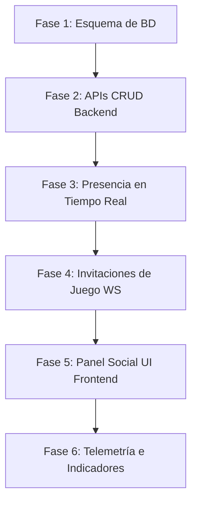

# Roadmap Social: Agregar Amigos e Invitaciones a Partidas

Este documento expone la planificación estratégica y técnica para expandir el sistema implícito actual de **Social Affinity** hacia un **Sistema de Amigos y Presencia Explícito** completo. Esto permitirá a los jugadores enviarse solicitudes de amistad, ver quién está en línea y realizar invitaciones directas a salas de juego, con un enfoque absoluto en la **seguridad de datos** y el **análisis arquitectónico con Graphify**.

---

## ESTRUCTURA DEL ROADMAP SOCIAL (6 FASES)



---

### FASE 1: Expansión de la Base de Datos Operativa (Esquema y Migración)

*   **Objetivo estratégico:** Establecer los modelos físicos para persistir las relaciones explícitas de amistad y las solicitudes pendientes en la base de datos de producción (`schema.prisma`).
*   **Análisis Graphify:** Antes de alterar el esquema, utilizar Graphify para comprobar si algún servicio del servidor depende directamente de la estructura del modelo `User`:
    ```bash
    graphify explain "User"
    ```
*   **Tareas ejecutables:**
    *   Definir el modelo `FriendRequest` con estados: `PENDING`, `ACCEPTED`, `REJECTED`.
    *   Definir el modelo `Friendship` con relaciones bidireccionales únicas entre dos usuarios.
    *   Ejecutar la migración física mediante `npx prisma migrate dev` para aplicar los cambios a la base de datos PostgreSQL.
*   **Seguridad:** Asegurar que los modelos tengan cascadas de borrado correctas (`onDelete: Cascade`) para cumplir con la eliminación de datos solicitada por los usuarios (derecho al olvido / GDPR).

---

### FASE 2: APIs REST CRUD para la Gestión de Amigos

*   **Objetivo estratégico:** Implementar los endpoints HTTP necesarios para que los usuarios registrados gestionen su lista de amigos y sus solicitudes pendientes con seguridad y validaciones.
*   **Foco en Seguridad:**
    *   **Autenticación:** Las rutas deben protegerse bajo el middleware de sesión de la aplicación (`Session.ts`). El `userId` del emisor debe extraerse de `req.user.id`, nunca del cuerpo de la petición (`req.body`).
    *   **Autorización:** Validar que solo el usuario receptor de una solicitud de amistad pueda aceptarla o rechazarla. Un tercero no debe poder manipular solicitudes ajenas.
    *   **Control de Spam:** Limitar la frecuencia con la que un usuario puede enviar solicitudes de amistad (Rate Limiting) para evitar ataques de denegación de servicio (DoS) a nivel lógico.
*   **Tareas ejecutables:**
    *   Crear `FriendshipService.ts` en `server/services/` para resolver la lógica de negocios.
    *   Desarrollar los siguientes endpoints:
        *   `POST /api/social/friends/request`: Enviar solicitud de amistad.
        *   `GET /api/social/friends/requests`: Listar solicitudes recibidas y enviadas pendientes.
        *   `PUT /api/social/friends/request/:id/accept`: Aceptar una solicitud.
        *   `PUT /api/social/friends/request/:id/reject`: Rechazar una solicitud.
        *   `DELETE /api/social/friends/:friendId`: Eliminar un amigo.
        *   `GET /api/social/friends`: Obtener lista de amigos aceptados.
*   **Validación:** Diseñar el script de integración `scripts/test-friend-system.ts` que simule intentos de bypass de seguridad (ej. un usuario C intentando aceptar la solicitud de A hacia B) y verifique la denegación (403 Forbidden).

---

### FASE 3: Transmisión y Propagación de Presencia en Vivo (WebSockets)

*   **Objetivo estratégico:** Implementar la propagación de estados de conexión (Online/Offline/DND/Invisible) en tiempo real a los amigos activos.
*   **Foco en Seguridad:**
    *   **Bypass de Privacidad:** Validar estrictamente el estado de visibilidad del usuario en Redis (`presence:status:userId`). Si el usuario cambia a `INVISIBLE`, sus amigos no deben recibir eventos de conexión.
    *   **Spoofing de Sockets:** Validar en el ciclo del socket que el usuario no pueda emitir cambios de estado de presencia a nombre de otro `userId`.
*   **Tareas ejecutables:**
    *   Modificar la gestión del ciclo de vida en `server/handlers/Joinroom.ts` y las rutinas de desconexión del servidor para disparar notificaciones en tiempo real.
    *   Al conectar un usuario, buscar en la BD sus amigos online y enviarles un evento de WebSocket `friend_connected`.
    *   Al desconectarse el usuario, buscar a sus amigos activos y transmitirles `friend_disconnected`.
*   **Entregables:**
    *   Eventos y handlers adicionales en `server/handlers/Handlers.ts` y `server/services/NotificationSystem.ts`.

---

### FASE 4: Flujo de Invitaciones a Partidas e Integración de Salas

*   **Objetivo estratégico:** Habilitar a los jugadores para enviar invitaciones directas de juego a sus amigos en línea, permitiéndoles unirse al mismo lobby con un solo clic.
*   **Foco en Seguridad:**
    *   **Validación de Destino:** Validar que el `roomId` al que se invita al jugador exista realmente en el `roomManager` del servidor antes de despachar el payload.
    *   **Relación de Confianza:** El servidor debe verificar activamente que exista una amistad con estado `ACCEPTED` entre el emisor y el receptor antes de enviar la invitación.
*   **Tareas ejecutables:**
    *   Crear el evento de mensajería WebSocket `send_game_invite` con payload `{ targetUserId, roomId }`.
    *   Despachar el evento `game_invite_received` con los metadatos `{ senderName, roomId, mapName }` al socket del amigo receptor.
    *   Diseñar la expiración automática de invitaciones de juego (ej. a los 30 segundos) utilizando Redis o timeouts en memoria.
*   **Entregables:**
    *   Handler de invitaciones en `server/handlers/MessageRouter.ts` y servicio de invitaciones temporales.

---

### FASE 5: Panel UI Social en el Catálogo y Lobby del Cliente

*   **Objetivo estratégico:** Proveer el componente visual en el frontend para que los usuarios interactúen con el sistema social sin comandos de consola.
*   **Foco en Seguridad:**
    *   **Sanitización de UI:** Evitar inyección de HTML o scripts (XSS) al renderizar la lista de amigos y solicitudes utilizando propiedades seguras de manipulación del DOM (`textContent` en lugar de `innerHTML`).
*   **Tareas ejecutables:**
    *   Crear el componente `SocialPanel.ts` en `src/client/ui/`.
    *   Renderizar la pestaña de lista de amigos con sus estados (ej. "Jugando en Arena", "Online", "Ausente").
    *   Agregar botones rápidos en la lista de amigos para "Invitar a partida" y "Unirse a partida".
    *   Implementar la barra de búsqueda para buscar otros jugadores por `username` y el botón "Enviar Solicitud".

---

### FASE 6: Telemetría y Monitoreo del Engagement Social

*   **Objetivo estratégico:** Capturar telemetría analítica sobre el uso del sistema de amigos para medir su impacto en la retención ($D1$/$D7$) de la plataforma.
*   **Foco en Seguridad (Privacidad PII):**
    *   Cumplir con las directrices de la Fase 24 (Auditoría de PII). La telemetría no debe capturar IPs de origen o datos de navegación sin anonimizar mediante hashes con sal.
*   **Tareas ejecutables:**
    *   Definir esquemas JSON para los nuevos eventos: `friend_request_sent`, `friend_request_accepted`, `game_invite_sent`, `game_invite_accepted`.
    *   Registrar impresiones y conversiones del panel social (CTR de invitaciones aceptadas).
*   **Entregables:**
    *   Esquemas JSON en `server/analytics/schemas/`.
    *   Consultas y reportes en `server/analytics/reports/social_engagement.ts`.

---

## MANTENIMIENTO DEL GRAFO DE CONOCIMIENTO (MANDATORIO)

Al finalizar la implementación de cualquiera de las fases anteriores, es imperativo actualizar el Grafo de Conocimiento del proyecto para mantener alineado el contexto de las IAs del equipo:
1. **Regenerar el Grafo:** Ejecutar `.venv/bin/graphify update .` para incorporar las nuevas clases, tipos e importaciones creadas en la base del AST.
2. **Wiki Externa:** Crear o actualizar la documentación en sidecars markdown dentro de `graphify-out/wiki/` (ej. `fase_social_02_friends_api.md`) detallando contratos de red, modelos y puertos.
